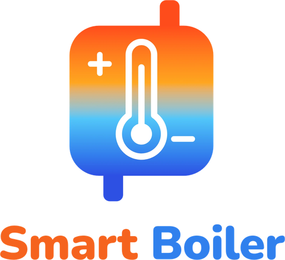

[Polska wersja](README.pl.md)

[![Status][status-shield]](#status)
[![Release][release-shield]][releases]
[![Commit activity on dev][commits-shield]][commits]
[![License][license-shield]][license]
[![HACS][hacs-shield]](#installation)

# Smart Boiler for Versatile Thermostat

  

<b>
Runs a central heating boiler from what Versatile Thermostat's rooms need, and always hands it
back safely.
</b>

> **Not released yet — do not install it on a heating system you rely on.**
> The integration is being built and has not run on a real boiler. There is no release and no
> entry in the Home Assistant Community Store (HACS); the first pre-release follows the tests on a
> test Home Assistant and a review.
> Where it stands: [Status](#status) · what comes next: [Roadmap](#roadmap).

**Smart Boiler for Versatile Thermostat** is a plugin for [Versatile Thermostat][vt] (VT) — not part
of VT and not made by its authors — that runs a central heating boiler — gas, oil, electric or
another fuel, any boiler Home Assistant can talk to, not a heat pump — from what the rooms actually
need: fewer and longer burns, more condensing where the boiler condenses, less fuel per degree-day —
with the same room comfort, and without disturbing the zone algorithms' own room models. It replaces
VT's on/off central boiler with control of the boiler's water temperature, and always knows how to
hand the boiler back to its own control.

It is **not** a room controller (rooms stay with VT and its algorithms), it does not drive
valves or heat pumps, and it sends no data outside your Home Assistant.

# What it does

- **Monitor first.** Before any control it watches the boiler for a monitoring period (7 days by
  default): burns and their length, condensing, hot-water draws, gas per degree-day, signal
  problems, and a verdict on whether control is worth it.
- **Weather-compensated water temperature** on a curve you enter, bounded by the lowest and
  highest water temperature, a weather ceiling and each circuit's maximum.
- **Heating on and off follow VT's zones** — by zones calling, total power or valve opening, as
  VT's central boiler does — and VT's central modes act through the zones.
- **Writes through what you have:** an entity you pick, the OpenTherm Gateway (Home Assistant's
  `opentherm_gw` or its firmware over MQTT), or a relay for an on/off boiler.
- **Safety first:** frost protection, protection against short cycling, read-back of every
  write, never fighting another controller, nothing written to the boiler's permanent memory,
  and a safe hand-back to the boiler's own control on every exit — retried until confirmed.
- Every option has a cautious default and a text that says what it does and what it risks.

# Integration with Versatile Thermostat

1. Set up VT's thermostats for the rooms the boiler heats. If VT's central boiler is configured,
   untick it in VT's central configuration and restart Home Assistant: the plugin takes its place.
2. Add one **Smart Boiler for Versatile Thermostat** entry and pick the VT zones this boiler heats.
3. Pick the entity that provides each boiler signal — at least flame and flow temperature for
   control.
4. Let it monitor for the monitoring period (7 days by default) and read its verdict.
5. Then, if you choose, set up control in the options and switch **Control (experimental)** on.

Step by step: the [user guide][guide].

# Status

| Stage | State |
|---|---|
| 0.1 Monitor (read-only) | built, published together with 0.2 |
| 0.2 Control base | built; corrected after three full reviews (0.2.1, 0.2.2, 0.2.3) |
| Tests on a test Home Assistant | next |
| Review before a real boiler | after those tests |
| First pre-release (provisionally 0.2.3b1) | after the review |

# Roadmap

| Release | Content |
|---|---|
| 0.2 Control base | the monitor plus control of the water temperature, the safe hand-back, frost protection |
| 0.3 Anti-cycling and room values | duty cycling and summer/winter from the forecast, a modulation cap, room-value mode, underfloor behind a mixing valve |
| 0.4 Learning and tuning | water-side learning, suggestions, seasonal tune-up |
| 0.5 Forecast | anticipation for slow emitters from recorded forecasts |
| Later | hot-water charging, the HACS default list, more devices |

Targets are aims, not commitments; each release collects data for the next. Details:
[`PLAN.md`][plan].

# Documentation

| Document | What it holds |
|---|---|
| [`SCOPE.md`][scope] | the specification: what the plugin does, its principles and every decision |
| [`PLAN.md`][plan] | the development plan, releases and the test environment |
| [`docs/`][docs] | the plan of each release and the reviews of the code |
| 🇬🇧 [User guide][guide] · 🇵🇱 [Przewodnik użytkownika][guide-pl] | prerequisites, installation, quick start, how it works, boiler connections, safety, alarms |
| 🇬🇧 [Technical documentation][technical] · 🇵🇱 [Dokumentacja techniczna][technical-pl] | the integration's parts, one control step, lifecycle, stored state, tests |
| [`CONTRIBUTING.md`][contributing] | how to contribute: branches, tests, rules |
| [`LICENSE`][license] | Apache License 2.0 |

`main` holds these documents; the code under development lives on the [`dev`][dev] branch and
reaches `main` with the first release.

# Installation

Not yet: there is no release. Once there is, it will install through HACS as a custom repository.

# Contributing

Contributions are welcome — open pull requests against `dev`. Read
[`CONTRIBUTING.md`][contributing] first: this integration controls a home's heating, so every
change is small, tested and reviewed. Which automatic checks run, and when, is in its section
[Checks](CONTRIBUTING.md#checks).

# Authors

[@Shadow-230](https://github.com/Shadow-230)

# License

[Apache License 2.0][license].

[vt]: https://github.com/jmcollin78/versatile_thermostat
[dev]: https://github.com/Shadow-230/vtherm-smart-boiler/tree/dev
[scope]: SCOPE.md
[plan]: PLAN.md
[docs]: docs/
[guide]: documentation/en/user-guide.md
[guide-pl]: documentation/pl/user-guide.md
[technical]: documentation/en/technical.md
[technical-pl]: documentation/pl/technical.md
[contributing]: CONTRIBUTING.md
[license]: LICENSE
[releases]: https://github.com/Shadow-230/vtherm-smart-boiler/releases
[commits]: https://github.com/Shadow-230/vtherm-smart-boiler/commits/dev
[status-shield]: https://img.shields.io/badge/status-in%20development-orange.svg?style=for-the-badge
[release-shield]: https://img.shields.io/badge/release-none%20yet-lightgrey.svg?style=for-the-badge
[commits-shield]: https://img.shields.io/github/commit-activity/m/Shadow-230/vtherm-smart-boiler/dev.svg?style=for-the-badge
[license-shield]: https://img.shields.io/badge/license-Apache%202.0-blue.svg?style=for-the-badge
[hacs-shield]: https://img.shields.io/badge/HACS-not%20yet-lightgrey.svg?style=for-the-badge
