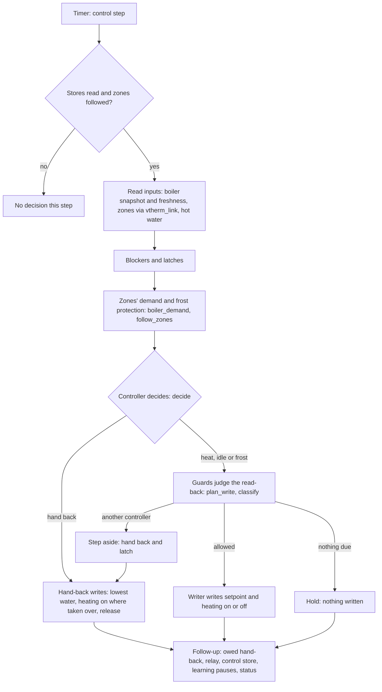

[Polska wersja](../pl/technical.md)

# Versatile Thermostat Smart Boiler — technical documentation

> **In development, not released.** The integration has not yet run on a real boiler.

This document describes how the integration is built: its parts, one control step, its
lifecycle, what it stores and how it is tested. What it does for the user is in the
[user guide](user-guide.md); every rule and decision is in [`SCOPE.md`](../../SCOPE.md).
Abbreviations: Home Assistant (HA), Versatile Thermostat (VT), OpenTherm Gateway (OTGW), Message
Queuing Telemetry Transport (MQTT).

## Contents

1. [Overview](#1-overview)
2. [Repository structure](#2-repository-structure)
3. [Component responsibilities](#3-component-responsibilities)
4. [One control step](#4-one-control-step)
5. [Lifecycle](#5-lifecycle)
6. [Persistent state](#6-persistent-state)
7. [Testing](#7-testing)

## 1. Overview

The integration (domain `vtherm_smart_boiler`) is a plugin of VT. It replaces VT's on/off
central boiler: it reads VT's zones, decides when the boiler heats and how warm its water is,
writes that to the boiler and hands the boiler back on every exit.

- **Pure logic in `core/`.** Every control and learning law, the monitor's analysis and the
  verdict are pure Python with no HA imports — a test parses the imports of `core/` to enforce
  it. The same core runs in the unit tests, in the simulator and in HA.
- **The HA side** around it gathers inputs from the entities the user picked, runs the core on
  timers and state changes, carries out its writes, and publishes sensors, binary sensors,
  switches, buttons and repair issues.
- **`vtherm_link.py` is the only door to zone data.** It reads VT's climate entities and VT's
  central configuration, and detects what is installed (VT and its version, `vtherm_api`,
  SmartPI) instead of assuming it. No other module looks up a zone's state by entity name.
- **A feature manager registered with VT** (`feature_manager.py`, through `vtherm_api`'s
  `register_feature_manager`) shows two of the plugin's zone values on each VT thermostat. It is
  registered only once VT is loaded; a thermostat already running sees it only after VT's next
  reload, which the plugin never triggers itself. Nothing in control depends on it.

Details: [`SCOPE.md`, §2](../../SCOPE.md#2-why-a-plugin) and
[§5](../../SCOPE.md#5-hardware-circuits-and-zone-algorithms).

## 2. Repository structure

```text
custom_components/vtherm_smart_boiler/   the integration (HA side)
├── core/                                 pure logic, no HA imports
├── transport/                            reading the boiler's entities, and the writers
└── translations/                         en.json (the source) and other languages
tests/                                    tests: core/, integration/, sim/, tools/, and the rest
sim/                                      the physics simulator and its test-only HA components
tools/                                    recorder history importer for offline analysis
devenv/                                   the test HA (Docker compose) for acceptance scenarios
scripts/                                  env.sh (runs every command inside the project), deploy
```

- `sim/custom_components/` holds `boiler_sim` (the simulated boiler, rooms and weather) and a
  stand-in `opentherm_gw`, both for tests only.
- `tools/import_history.py` turns a copy of an HA recorder database into the core's history,
  so the monitor's analysis can be checked on recorded data.

## 3. Component responsibilities

**Setup (`__init__.py`).** Reads the entry's options into an `EntryConfig`, builds the
coordinator and the control unit, attaches the coordinator to the feature manager, and on
unload stops the control unit first (it hands back) and the coordinator last. HA is imported
inside functions only.

**Coordinator (`coordinator.py`, `SmartBoilerCoordinator`).** Follows the mapped entities,
keeps a rolling history and computes what the entities publish. A quick path runs on state
changes and every 30 seconds (readings, signal check, hot water, current alarms); the analysis
(`core/analysis.py`) runs every few minutes on a copy of the history, off the event loop. It
also owns the stores (see [Persistent state](#6-persistent-state)).

**Monitor and analysis (`core/monitor.py`, `core/analysis.py`, `core/verdict.py`).** From the
history to burns, metrics, trend warnings, a report and the control verdict, always with its
reasons. `core/alarms.py` holds the monitor's alarms, with hysteresis so they do not flap.

**Control unit (`control.py`, `ControlUnit`).** The HA side of control: a control step every
few seconds, its writes through the writer, the hand-back on every exit, learning pauses for
the zone algorithms, and the status the entities show. It turns guard events and failures into
alarms. The writer exists only while control is switched on. An internal error hands back and
latches control.

**Control step (`core/loop.py`, `loop_step`).** One step: the controller's decision through the
write guards to what is written now. The same step drives the simulator and HA. A relay has a
step of its own (`core/relay.py`).

**Controller (`core/controller.py`, `decide`).** A state machine that turns what the plugin
knows into a boiler command, in a fixed order of precedence: control switched off; a latch or
an alarm set to hand back; a missing precondition (a blocker); the boiler link lost or stale; the
boiler's own fault; otherwise heating on or off from frost protection and the zones' demand, and
the water temperature from the curve (`core/curve.py`), limits and ramp.

**Demand (`core/demand.py`, `boiler_demand`).** What VT's central boiler decided, now the
plugin's job: zones calling, total power or valve opening, each zone counted only while VT
reports it clearly.

**Zone watch (`core/zone_watch.py`, `follow_zones`).** The recognition period after a start
(at most 10 minutes), each zone's grace period, and the case where every zone is unknown.

**Guards (`core/guards.py`, `plan_write`, `classify`).** What may actually be written, whatever
the controller asks for: nothing to the boiler's persistent memory, a write-rate guard, repeats
where a value expires. They judge the read-back and sort a change the plugin did not make into a
lost command, a value ignored from the start, a clipped value or another controller.

**Relay (`core/relay.py`).** An on/off boiler switched by a relay: what is written to it, what
its reported state means, and whether the boiler shows that it heats.

**Hand-back (`core/hand_back.py`).** The evidence of a hand-back: what shows a release, when a
steady third value means another controller holds a target, and when a two-valued target's
change is a lost command. The control unit writes the three parts and retries until confirmed.

**Writers (`transport/writers.py`).** The only code that changes the boiler: a writable entity,
the OTGW through HA's `opentherm_gw`, the OTGW firmware over MQTT, or a relay. Each writer knows
the services it may call (a test checks the list); a failed write raises `WriteError` and is
never assumed applied. Reading the boiler is in `transport/entities.py`, which writes nothing.

**Configuration (`config_flow.py`, `config.py`, `control_config.py`).** The setup and options
forms, and the control options as core objects with the blockers that keep control from
starting. `repairs.py` holds the repair flows (for example confirming a hand-back done by hand).

## 4. One control step

A timer runs the control unit's step (`ControlUnit._async_step` in `control.py`). The pure part
is `loop_step` in `core/loop.py`, which calls `decide` in `core/controller.py` and then the
guards in `core/guards.py`.



- **Freshness:** nothing is written without fresh boiler data. The link is judged over a window
  (lost once stale steps cover 5 minutes within 10; back after 60 seconds fresh).
- **Blockers and latches** come before demand: a latch, or an alarm set to hand back, hands
  back whatever the zones ask.
- **Decide:** heating on or off is decided at every step; the water temperature every decision
  interval (5 minutes by default) and at once after a blocker or fault ends.
- **Guards** see the read-back of every write; a hand-back is never held back by a guard.
- **Follow-up:** an owed hand-back is retried every minute until confirmed; the control state is
  saved at once when it moves (see [Persistent state](#6-persistent-state)).

Details: [`SCOPE.md`, §7](../../SCOPE.md#7-features-by-stage).

## 5. Lifecycle

**Setup.** `async_setup_entry` reads the options; a control section that cannot be used leaves
control out, not the whole entry, so the monitor keeps running and a hand-back still owed goes
out. The coordinator reads its stores; the control unit reads the control state cautiously (see
below) and, before anything else can fail, makes one attempt at a hand-back the last run left
owed (a failure stays owed and is retried by the clock). Then the coordinator and the control
unit start, the control unit registers its shutdown job, and the coordinator is attached to the
feature manager.

**Recognition period.** After HA starts or VT reloads, the zones report one by one. The
controller takes no new decision until every zone has reported, for at most 10 minutes. A
command held before the restart is kept or restored at once if nothing forbids it; otherwise the
boiler is handed back first. VT may show a thermostat it has not started as "off"; that is never
read as "no demand".

**Reload.** Saving the options reloads the integration: while control holds the boiler, it is
handed back and taken again (a relay goes to its rest state and back).

**HA stop.** The hand-back runs in a shutdown job (`hass.async_add_shutdown_job`), which HA runs
before its stop event. All shutdown jobs share one 20-second limit, after which HA cancels those
still running; the hand-back is built to end within it. A hand-back not confirmed by then stays
owed in the control store and is retried at the next start.

**Unload.** `async_unload_entry` stops the control unit first (it hands back), detaches the
feature manager, unloads the platforms and stops the coordinator last.

**Removal.** If a hand-back is still owed when the entry is removed, it can no longer be retried:
a repair issue that outlives the entry tells the user to hand back by hand.

## 6. Persistent state

Control has a store of its own (`ControlStore` in `coordinator.py`), apart from the entry's main
store, which holds the monitor's history and day summaries.

- **What it holds:** whether control is enabled, the last command and whether the plugin is
  controlling, latches and their causes, a hand-back owed and its release evidence, learning
  pauses, the baselines the guards compare against, the relay's observations, and the active
  control alarms.
- **Written at once:** every change that a crash must not lose — the controlling marker, a
  latch, an owed hand-back — is saved immediately and atomically. The outcome of each write is
  noted; a write that failed raises a repair issue (full disk or read-only storage).
- **Read cautiously** (`async_read_control_state`): when the store cannot be read (missing,
  damaged or of another shape) and the options hold a control section, a hand-back counts as
  owed and the boiler as held, so the plugin hands back to be safe.

## 7. Testing

Three layers ([`PLAN.md`, "Test environment"](../../PLAN.md#test-environment)):

1. **Core tests** (`tests/core/`) — plain pytest, no HA, no network.
2. **Integration tests** — `pytest-homeassistant-custom-component`: HA runs inside the test
   process; no instance, no network. Continuous integration (CI) also fetches VT 10.4.0 and
   SmartPI 0.4.0 from their tags, so the tests with a real VT run on every change.
3. **Test HA** — a dedicated container (`devenv/`) running the plugin, VT, SmartPI and the
   simulator, where the acceptance scenarios run before anything reaches a real boiler.

**The simulator** (`sim/simulator.py`, with `sim/custom_components/boiler_sim`) models the
boiler, rooms and weather. A scenario sets the plant, the weather, hot-water draws and the zone
valves, and can call a controller every control period; commands reach the simulated boiler as
through a gateway. Control is tested only against the simulator.

**Running the checks**, as [`CONTRIBUTING.md`](../../CONTRIBUTING.md) says, each through
`scripts/env.sh`:

```sh
scripts/env.sh python -m pytest -q -p no:homeassistant --disable-socket --allow-unix-socket \
    tests/core
scripts/env.sh python -m pytest -q --ignore=tests/core
scripts/env.sh ruff check .
scripts/env.sh ruff format --check .
scripts/env.sh mypy
```
