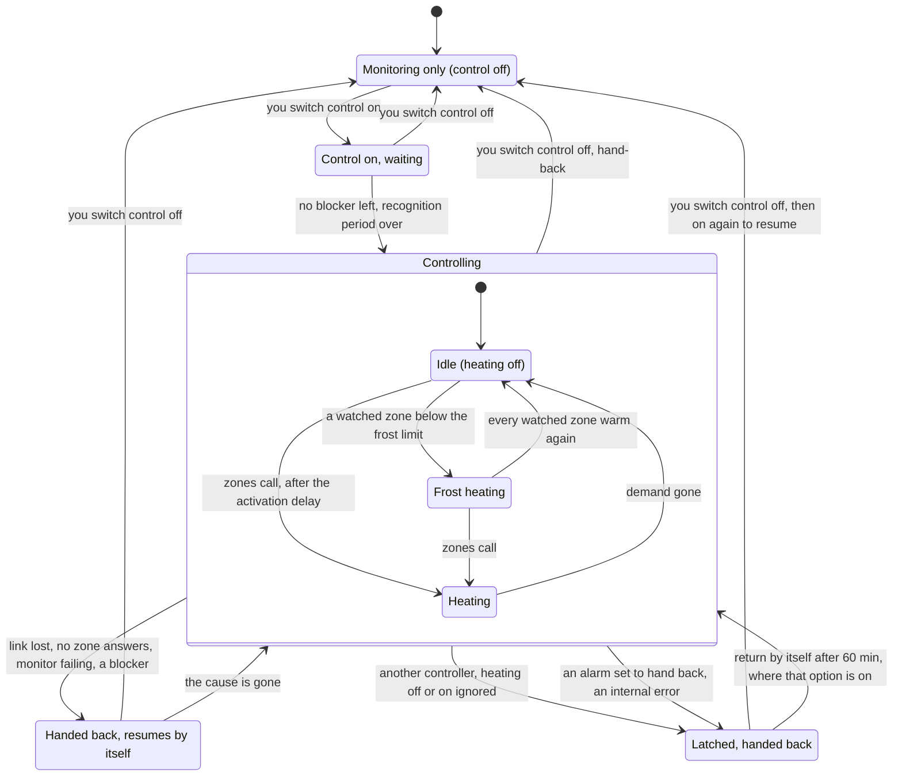

[Polska wersja](../pl/user-guide.md)

# Smart Boiler for Versatile Thermostat — user guide

> **In development, not released.** The integration has not yet run on a real boiler. There is
> no release and no entry in the Home Assistant Community Store (HACS). Do not install it on a
> heating system you rely on.

Smart Boiler for Versatile Thermostat is a plugin (not part of VT and not made by its authors) for
Versatile Thermostat (VT), a Home Assistant integration that runs the rooms of a house. VT decides
how much heat each room needs. This plugin watches a central heating boiler (gas, oil, electric or
another fuel; not a heat pump) and, once you switch control on, decides when the boiler heats and
how warm its water is. It does not control rooms or valves.

This guide is a summary. The specification, with every rule and decision, is
[`SCOPE.md`](../../SCOPE.md). Where the two differ, `SCOPE.md` and the texts in the
integration's own forms are the reference. Some values in the specification are still marked
"provisional": they may change before the first release. How the plugin is built is described in
the [technical documentation](technical.md).

## Contents

1. [Prerequisites](#1-prerequisites)
2. [Installation](#2-installation)
3. [Quick start](#3-quick-start)
4. [How it works](#4-how-it-works)
5. [Connecting the boiler](#5-connecting-the-boiler)
6. [Safety and hand-back](#6-safety-and-hand-back)
7. [Alarms and repair issues](#7-alarms-and-repair-issues)
8. [State diagram of control](#8-state-diagram-of-control)

## 1. Prerequisites

- **Home Assistant 2026.9 or later** — the version the plugin is tested on.
- **Versatile Thermostat 10.2.0 or later**, with its thermostats (the plugin calls them zones)
  set up for the rooms this boiler heats. VT loads external feature managers from 10.2.0;
  10.4.0 is the version tested. The minimum is provisional and is confirmed before the first
  release.
- The `vtherm_api` library, 0.5.0 or later. Home Assistant installs it with the plugin.
- **A boiler that Home Assistant can read**, through any integration that shows its signals as
  entities: for example the OpenTherm Gateway (OTGW), EMS-ESP or an ESPHome OpenTherm controller.
  A boiler with only on/off room-thermostat terminals can be monitored and switched by a relay.
- **The signals mapped.** You pick the entity that provides each signal; none is required for
  monitoring. Flame and flow temperature enable the burner's metrics and the boiler link, and
  control of the water temperature needs both. Every other signal (return temperature, water
  pressure, modulation, outdoor temperature, a gas meter and others) enables more of the monitor.
- **For control:** a way to write to the boiler and to hand it back (see
  [Connecting the boiler](#5-connecting-the-boiler)), and VT's own central boiler switched off.

SmartPI and VT's Auto-TPI (VT's self-learning time-proportional algorithm) are optional; the
plugin works with any VT zone algorithm.

## 2. Installation

There is **no release yet**, so the integration cannot be installed through HACS today.

Once there is a release, it will install through HACS as a custom repository:

1. In HACS, open the menu → **Custom repositories**, add
   `https://github.com/Shadow-230/vtherm-smart-boiler` with the type **Integration**.
2. Find **Smart Boiler for Versatile Thermostat** in HACS and download it.
3. Restart Home Assistant.

**Manual installation** (once there is a release): copy the folder
`custom_components/vtherm_smart_boiler/` from the release into the `custom_components/` folder
of your Home Assistant configuration, then restart Home Assistant.

Only one entry of the integration can exist: it runs one boiler.

## 3. Quick start

1. **Prepare VT.** Set up VT's thermostats for the rooms. If VT's central boiler is configured,
   untick it in VT's central configuration and restart Home Assistant, so that two controllers
   never drive the same boiler. Monitoring works without this; control waits for it.
   If you create VT's central configuration (or change it) after Home Assistant has started —
   even without a central boiler — restart Home Assistant once before you switch control on:
   until then control waits, as the plugin cannot tell what VT ran meanwhile.
2. **Create the entry.** Settings → Devices & services → Add integration →
   **Smart Boiler for Versatile Thermostat**. The first panel asks **how the boiler is connected**
   (the OpenTherm Gateway integration, the OTGW firmware over MQTT, ESPHome OpenTherm, EMS-ESP, a
   relay, the boiler's own Wi-Fi module or the manufacturer's integration, another writable
   entity, or another integration that only reads), its **heat source** and its **type**
   (single-function or combi, with or without a hot-water tank). The second asks the **control
   mode** — full control, on/off, room temperature only (from version 0.3; monitoring until then)
   or monitoring only — with condensing and the hot-water priority where they apply. None of these
   is chosen for you, and none switches anything on. Then pick a name and the level of detail (the
   level changes only what you see, never how the plugin behaves). The same panels open the
   integration's options, under **Boiler, connection and control mode**. What each connection
   means is in [Connecting the boiler](#5-connecting-the-boiler).
3. **Pick the signals.** In **Boiler signals** pick the entity for each signal you have — at
   least flame and flow temperature if you plan to control the boiler. The plugin only reads
   these entities. With the OpenTherm Gateway integration and exactly one gateway, its boiler
   entities are filled in for you to check. On the OTGW firmware over MQTT and on EMS-ESP a step
   asks the device's MQTT topics (see [Fresh data](#68-fresh-data)).
4. **Describe the installation.** The steps **Boiler**, **Heating circuit**, **VT zones** (with
   one **Zone** step for each zone you pick), **Building** and **Reference room** ask what you
   know. Leave unknown values empty: the plugin then says what it cannot judge. **Boiler** also
   takes the water-pressure limits from the boiler's manual and its safety valve; **Building**
   takes the design outdoor temperature, which the heating curve shares.
5. **Days of data for the verdict.** At the advanced level the step **Monitor** holds
   **Days of data for the verdict** (7 days by default, 7 to 60). It can also be changed later in
   the options under **Monitor thresholds**. It holds nothing back: you may set up and switch on
   control at any time. Until you do, the plugin writes nothing to the boiler.
6. **Read the verdict.** Once it has these days of data, the sensor **Control verdict** says
   whether control is worth enabling (see
   [Monitoring and the verdict](#41-monitoring-and-the-verdict)). You decide.
7. **Set up control.** With full control or on/off chosen, the setup itself goes on into the
   control steps: the write path, then the steps that follow (for example **Heating curve and
   limits** and **Control behaviour**). To set it up later, or change it, open
   **Control (experimental)** in the integration's options. "No control" keeps monitoring only.
8. **Switch control on** with the switch **Control (experimental)** of the integration's device.
   If something is missing, the switch says what, and the monitor keeps running.

## 4. How it works

The details of every rule are in the specification:
[`SCOPE.md`, §7](../../SCOPE.md#7-features-by-stage) and
[§10](../../SCOPE.md#10-assess-alongside-control).

### 4.1 Monitoring and the verdict

After you add the integration, it only watches the boiler. It writes nothing, and the boiler runs
as it did before — under Versatile Thermostat's central boiler, a wall thermostat or its own
regulation — until you switch control on, which you may do from the first day. It records, for
example:

- burns and how long they last, and how often the boiler starts;
- how much of the time the boiler condenses (if you map the signals it needs);
- hot-water draws, and gas per degree-day (measured with a gas meter you map, else estimated);
- problems with the signals it reads.

The verdict needs **7 days of data** by default. You may ask for more (up to 60 days), but not
fewer. They count calendar days from the day you created the entry.

Then the sensor **Control verdict** shows one of:

| Verdict | Meaning |
|---|---|
| Worth enabling | the plugin saw problems that its control changes, for example short burns |
| Not worth enabling | enough was measured, and control would change little |
| Not enough data yet | too little was measured to judge |

The verdict is advice. You decide. Before it comes, and outside the heating season when the days
pass without enough data, the control switch says that control starts without a verdict.

### 4.2 Control is opt-in

Control is **off by default**. It is the switch **Control (experimental)**. You can switch it on
from the first day, once every required setting is filled in, for example:

- the control mode "full control" or "on/off" (monitoring only and room temperature only keep
  control off, and the switch says so);
- a way to write to the boiler and a way to hand it back (see
  [Connecting the boiler](#5-connecting-the-boiler)), fitting the boiler's connection;
- the heating curve's design flow temperature (it has no default);
- exactly one heating circuit fed straight from the boiler (or through a fixed thermostatic
  mixing valve);
- VT's own central boiler switched off in VT, followed by a Home Assistant restart, so that two
  controllers never drive the same boiler. A VT central configuration created or changed after
  Home Assistant started, even without a central boiler, needs that one restart too.

When something is missing, the control switch says what. The monitor keeps running, and the
boiler stays with its own control or its thermostat.

### 4.3 When heating goes on and off

The plugin replaces VT's central boiler. It decides heating on or off from VT's zones, in the
same way VT's central boiler does. You choose one or more of these criteria:

| Criterion | Heating is on when |
|---|---|
| Zones calling | at least the set number of zones call for heat (default 1) |
| Total power | the zones' power together reaches the set threshold |
| Valve opening | the calling zones' valve opening reaches the set threshold |

- The decision is checked every 10 seconds and acts at once, in both directions.
- VT counts heating devices; this plugin counts **zones**. If you move over from VT's central
  boiler, check the number.
- A zone counts only while VT reports it clearly. A zone that is unavailable, or that VT has not
  started yet, is "unknown" — never "no demand".
- VT's central mode (Auto, Stopped, Heat only, Cool only, Frost protection) acts through the
  zones. With every zone stopped, nothing calls for heat, so the boiler stays off. "Stopped" in
  VT does not hand the boiler back; frost protection still watches.
- There is no summer switch in the plugin. If VT's zones are off, the boiler does not heat.

### 4.4 The water temperature

While heating is on, the plugin sets the boiler's water (flow) temperature:

1. **The heating curve** — you enter it: the design outdoor temperature (default −15 °C), the
   design flow temperature (required, no default) and an optional offset. The curve gives a
   water temperature for each outdoor temperature.
   **The curve's room temperature** (advanced level): **Auto** (default) follows the highest
   setpoint among the zones that heat now — the warmest room you keep — at most 23 °C, and with
   VT's presets (eco at night lowers it); you can leave rooms out (a bathroom kept warmer).
   **Manual** keeps the value you enter: the setpoint of your warmest room. Too low leaves rooms
   cold in mild weather. An entry set up before this version runs Manual with its value. The
   control state shows the room temperature in use (`curve_room`).
   The design outdoor temperature is one value with the building's: changing it in either step
   changes both. The curve step also shows the boiler's maximum heating setpoint and the first
   circuit's maximum flow temperature — the lowest of the three, these two and the highest water
   temperature, applies.
2. **Lowest water temperature** — the curve never goes below it. Default 20 °C (provisional).
   Too low, and the boiler may stop by itself again and again in mild weather; a boiler that does
   not condense may condense in its flue. Take the value from the boiler's manual. The monitor
   may suggest a higher value if it sees many short burns; nothing changes by itself.
3. **Highest water temperature** — never above it. Default 70 °C.
4. **Weather ceiling** (shown as "Room for correction") — how far anything may raise the water
   above the curve. Default 10 K (kelvin, a temperature difference).
5. **Circuit maximum** — each circuit's "Maximum flow temperature", for example for underfloor
   heating. The plugin never asks for more. The boiler itself may overshoot it a little; an
   optional alarm tells you when the measured flow stays too high.

The water temperature changes slowly (the ramp, default 1 K per minute). It is re-decided every
5 minutes by default (the decision interval).

If the outdoor temperature is lost, the plugin uses the weather entity, then keeps the last
known value for 3 hours, then uses your fallback setpoint or the curve's design point. A failed
outdoor sensor never means zero heat.

**Comfort correction** — **on by default with full control** (an entry set up before this
version keeps what it ran with). When a room stays short of its setpoint with its valve fully
open, the water rises slowly above the curve, up to its limit: 3 K by default, up to 10 K at the
advanced level, never more than 3 K a day. For a room whose SmartPI is in its learning phase,
"short" means below its setpoint + 0.5 K, where SmartPI stops heating it. It does not rise when
the boiler starts more often than before. After three hours at its limit with a room still
short, a repair issue names the room: the curve is too low there — raise the curve. What it
costs: more gas, and possibly more burner starts; its text in the form explains the risk with
VT's TPI zones. Watch the starts, and switch it off if they climb. A "Reset comfort correction"
button sets it back to zero.

### 4.5 Frost protection

Frost protection heats even when no zone calls for heat:

- It watches every zone (default) or one zone you pick.
- When a watched zone falls below **5 °C** (default), heating runs on the curve until every
  watched zone is above **7 °C** (default).
- It heats only a room whose heat can reach it: VT reports the valve open or the device on. If
  VT keeps a cold room closed (thermostat off, open window, central mode "Stopped"), the plugin
  does not start the boiler for it. It raises a repair issue that names the room and says what
  to do — for example, use VT's frost preset instead of "off".
- If frost heating runs for about 2 hours without the room warming, an alarm tells you. Heating
  is not stopped for that.

### 4.6 VT's activation delay

The plugin keeps VT's activation delay: 0 to 600 seconds, default 0. It is for slow valves
(for example thermoelectric heads on underfloor heating), so they open before the boiler and its
pump start.

- It delays **switching on** only. Switching off is never delayed.
- The wait starts at the first real call for heat. If the call drops and returns during the
  wait, the wait goes on; at its end the boiler starts only if demand is still there.
- Frost heating waits for it too.
- When you move over from VT, the value is pre-filled from VT's setting for you to confirm.

### 4.7 After a restart

**Recognition period.** After Home Assistant starts or VT reloads, the plugin waits until every
zone has reported, for at most 10 minutes. It takes no new decision meanwhile. If it was
controlling the boiler before the restart, and nothing has changed that forbids it, it keeps or
restores its last command at once (with no activation delay). If something has changed, it hands
the boiler back first.

**Grace period.** If a zone becomes unknown while VT runs, its last answer is kept for 10
minutes. After that it drops out and the other zones decide. A zone unknown for 30 minutes
raises an alarm, because frost protection cannot see it.

**No zone answers.** If every zone is unknown after these periods, or none of your demand
criteria gets any data, nothing can ask for heat:

| Your installation | What happens |
|---|---|
| A working thermostat or room controller (see below) | the boiler is handed back to it |
| No working thermostat | the plugin keeps heating off; it does **not** hand back |

In both cases an alarm ("Control: no zone answers") and a repair issue appear at once. Control
resumes by itself when a zone answers again.

A **working thermostat** is one of:

- an OpenTherm thermostat wired to the gateway's thermostat terminals;
- on an entity path, the tick "The boiler has its own room controller";
- on a relay, that tick together with the relay's state after hand-back set to "on".

**A thermostat VT has not started** counts as unknown, even after the recognition period. VT may
show such a thermostat as "off" until it starts. The plugin does not read that "off" as "no
demand".

### 4.8 Hot water

The boiler type says whether the boiler heats hot water: single-function without hot water,
single-function with a tank, combi (instantaneous hot water) or combi with a built-in tank. For
every boiler that heats hot water the panels ask whether **hot water has priority**:

- **With priority** (default) — while the boiler heats hot water, the rooms get no heat. This is
  usual for a combi and for a tank charged through a three-way valve. The plugin then pauses
  SmartPI's learning in the zones during the draw, and counts the boiler's heat as not reaching
  the rooms.
- **Without priority** — hot water and heating run together (a tank charged in parallel, a
  buffer, a combi that shares its heat). Hot water then neither pauses learning nor counts as
  heat the rooms miss.

The wrong answer either pauses learning for nothing or lets it learn from draws that took the
rooms' heat. How burns are told apart as heating or hot water does not depend on it.

## 5. Connecting the boiler

The plugin reads the boiler through entities you pick in its forms. To control the boiler it
also needs a way to **write** to it — a "write path" — and a way to give the boiler back to its
own control — the **hand-back**.

Details: [`SCOPE.md`, §5](../../SCOPE.md#5-hardware-circuits-and-zone-algorithms) and
[Gateway topology](../../SCOPE.md#gateway-topology).

The first panel asks **how the boiler is connected**. The answer decides what the plugin can
write, how it hands the boiler back, and what the control steps offer:

| Connection | What the plugin writes | "Heating off" | Hand-back | If Home Assistant stops |
|---|---|---|---|---|
| OpenTherm Gateway (integration) | the control setpoint, repeated every 30 s | the gateway's heating enable off | the safe hand-back | the gateway drops the setpoint within a minute: a thermostat on it takes over; without one, heating stops |
| OTGW firmware over MQTT | the same, as the firmware's MQTT commands | as above | as above | as above |
| ESPHome OpenTherm | the setpoint number and the heating switch, both held by the ESP | the heating switch off | a value you declare (offered) | the ESP keeps the last setpoint and heating until it restarts, then takes its start values ([5.7](#57-esphome-opentherm)) |
| EMS-ESP | its flow setpoint, which lapses, repeated every 30 s | setpoint 0 ([5.8](#58-ems-esp)) | the device's timeout, 1 minute (offered) | the setpoint lapses within about a minute: the boiler returns to its own setting |
| Relay (on/off boiler) | the relay | relay off | its rest state | the relay stays as it was |
| The boiler's Wi-Fi module or the manufacturer's integration | nothing by default: monitoring | — | — | — |
| Another writable entity (advanced) | what you pick, with the write type you declare | a heating switch | your choice | up to the device |
| Another integration, read only | nothing | — | — | — |

The values in this table are provisional until the user review before release (K4). A control
set up for another connection is blocked ("The control set up does not fit the boiler's
connection"). ESPHome and EMS-ESP are controllers on Home Assistant's side: their topology is
"virtual". The Wi-Fi module and manufacturer integrations usually write to the boiler's memory
or through a cloud, so control is offered only with a write type that is known and not
persistent.

### 5.1 The write paths

You choose one in the control step ("Write path"), among those that fit the boiler's connection.
The default is "No control": the plugin only monitors.

- **Writable entity** — a boiler interface that offers writable entities, for example EMS-ESP
  or an ESPHome OpenTherm controller. The plugin writes the flow setpoint, and heating on and off
  through a switch.
- **OpenTherm Gateway (OTGW)**, through Home Assistant's `opentherm_gw` integration. The plugin
  writes the control setpoint and heating on and off through the gateway.
- **OTGW firmware over MQTT** (Message Queuing Telemetry Transport) — the same, sent as the
  firmware's MQTT commands.
- **Relay (on/off boiler)** — for a boiler with only room-thermostat terminals. Heating on and
  off only.

A heating on/off switch is **required** for water-temperature control in this version, except on
EMS-ESP, whose own setpoint 0 keeps heating off ([5.8](#58-ems-esp)). Without it, control stays
blocked and the monitor runs.

#### A writable entity

You pick the setpoint entity and the heating on/off switch, and declare how each keeps its
value ("Write type"):

| Write type | Meaning | What the plugin does |
|---|---|---|
| Expiring | the device drops the value unless it is repeated | repeats it every 30 seconds |
| Held by the device | the device keeps the last value | sends it on a change and every 5 minutes |
| Persistent | the value is stored in the boiler's memory | not written: control stays off |
| Unknown (default) | — | not written: control stays off |

You also pick the **hand-back method**:

- **Write a value** — a setpoint written on hand-back. You declare what it does: "Its own control
  resumes" or "Heating stops". The same number means different things on different devices, so
  there is no default.
- **Device timeout** — the device returns to its own control when the plugin stops writing. You
  enter the device's timeout (default 1 minute, 1 to 60).
- **Turn off a switch** — an "external control" switch that hands control back to the device.

#### The OpenTherm Gateway

The plugin sends the control setpoint and repeats it every 30 seconds, as the gateway drops it
otherwise. "Heating off" is the gateway's heating-enable switched off, held, and sent again with
every repeat. The plugin never changes the gateway's mode.

### 5.2 What hand-back means

On every exit — control switched off, an alarm set to hand back, Home Assistant stopping, a lost
boiler link, an error — the plugin hands the boiler back (see
[Safety and hand-back](#6-safety-and-hand-back)). What happens next depends on your
installation:

| Installation | After hand-back |
|---|---|
| Gateway with an OpenTherm thermostat | the thermostat takes over; heating continues |
| Gateway without a thermostat (stand-alone) | heating **stops** until control resumes or you act |
| Writable entity, value "Its own control resumes" | the boiler's own control heats |
| Writable entity, value "Heating stops" | heating **stops** until control resumes |
| Relay, "Relay after hand-back" = off (default) | no heat, unless a thermostat in parallel calls |
| Relay, "Relay after hand-back" = on | the boiler heats on its own dial or thermostat |

After a hand-back, or while Home Assistant is down, the boiler's (or the wall thermostat's) own
maximum water temperature applies, not the plugin's. Set an unmixed underfloor circuit's limit
there too.

The control switch shows what a hand-back does in your installation ("On hand-back").

### 5.3 The gateway topology

You declare how the gateway is wired ("Gateway connection"); Home Assistant cannot read it.

| Gateway connection | What the plugin may do |
|---|---|
| Gateway with a thermostat | control; hand-back returns the boiler to the thermostat |
| Gateway without a thermostat (stand-alone) | control; hand-back stops heating |
| Gateway in monitor mode | monitor only |
| Virtual: a controller on the Home Assistant side | control through that controller's entities |

For a gateway, the form also asks **what is wired to the gateway's thermostat terminals**:

| Answer | Control |
|---|---|
| OpenTherm thermostat | allowed (with "Gateway with a thermostat") |
| Nothing | allowed (with stand-alone) |
| On/off contact (two wires) | **blocked**: monitor only |
| I don't know | **blocked** until you check |

Why an on/off contact blocks control: the gateway keeps the plugin's "heating off" even after the
override ends. If Home Assistant crashed while heating was off, an on/off thermostat on the
gateway could then not heat the house. An OpenTherm thermostat is not affected.

Things to know with a gateway:

- **Stand-alone:** if Home Assistant stops for more than about a minute, the setpoint lapses and
  the boiler stops heating. After a stand-alone hand-back, frost protection rests on the boiler's
  own, if it has one.
- **With a thermostat:** while the plugin controls, the wall thermostat's heating setting and its
  off switch do nothing (its hot-water settings still work). After a hand-back it heats by its own
  setting and program, so keep them at what the house should get. The plugin warns when the wall
  thermostat's setpoint is unknown or below 15 °C (if you map that signal).
- A VT zone built on the gateway's own thermostat entity is refused.

### 5.4 The relay (on/off boiler)

The relay is a switch, or a boiler thermostat entity switched between heat and off. An
`input_boolean` (a Home Assistant helper) is refused, because it confirms nothing. The plugin
switches heating on and off only; it does not set a water temperature.

The plugin cannot read the relay's own settings, so the form asks you:

- the tick "this is a separate relay contact, not a setting stored in the boiler's memory" —
  control does not start without it;
- its state after a power cut, its own switch-off timer, and whether it reports its real state
  (each defaults to "I don't know", treated cautiously);
- the repeat interval (10 to 300 seconds, default 300);
- "Relay after hand-back": off (default) or on.

The form's texts recommend: the relay on the boiler's room-thermostat terminals, never in its
power supply; the old thermostat kept in parallel and set low; the relay starting "off" after a
power cut; one test in summer.

A relay out of reach raises an alarm after 5 minutes. There is no hand-back then, since nothing
could reach the relay; the command is sent again when it returns.

### 5.5 The tick "The boiler has its own room controller"

Tick it only if the boiler has a room controller of its own that asks for heat by itself once the
plugin lets go — for example a room unit on the boiler's bus. It is off by default.

- On a writable entity: when VT gives no answer at all, the boiler is handed back to that
  controller, and every other hand-back goes to it too.
- On a relay: it counts only with "Relay after hand-back" = on.
- On a gateway it is not offered: the thermostat terminals answer decides.

Without the tick, when VT gives no answer the boiler does not heat, and an alarm and a repair
issue tell you why.

### 5.6 Nothing goes to the boiler's permanent memory

The plugin writes only values that expire or that the device holds in working memory. A target
declared persistent, or of unknown type, is never written: control stays off and says why. Curve
parameters stored in the boiler are never written. The plugin also leaves the boiler's hot-water
enable as it was.

### 5.7 ESPHome OpenTherm

An ESP running ESPHome's OpenTherm component is the boiler's master: it keeps sending the last
setpoint and heating on/off it was given. If Home Assistant stops, the ESP goes on with them until
it restarts — by default 15 minutes after its last Home Assistant connection (its API
`reboot_timeout`) — and then takes the start values of its own configuration. So control on
ESPHome needs the tick **"On the ESP: safe start values and a short API reboot_timeout"**, never
ticked for you. Without it, control does not start ("The ESP's safe start not confirmed").

A sketch of the parts that matter — check the names against ESPHome's
[OpenTherm documentation](https://esphome.io/components/opentherm/) for your version, and fill in
your own pins and names:

```yaml
api:
  reboot_timeout: 5min        # restart, and take the start values below, soon after
                              # Home Assistant is gone

opentherm:
  in_pin: GPIO_IN             # your board's pins
  out_pin: GPIO_OUT

number:
  - platform: opentherm
    t_set:
      name: "Boiler setpoint"
      min_value: 0
      max_value: 80
      initial_value: 0        # no setpoint at start: no heating request
      restore_value: false    # never the last value from before the restart

switch:
  - platform: opentherm
    ch_enable:
      name: "Boiler heating"
      restore_mode: ALWAYS_OFF  # heating off at start

sensor:
  - platform: opentherm
    t_boiler:
      name: "Boiler flow temperature"
      force_update: true      # report unchanged values too
    t_ret:
      name: "Boiler return temperature"
      force_update: true
    rel_mod_level:
      name: "Boiler modulation"
      force_update: true

binary_sensor:
  - platform: opentherm
    flame_on:
      name: "Boiler flame"
```

In the plugin: the setpoint number is the setpoint entity, the heating switch the heating switch;
the control step offers both as "Held by the device", with the hand-back "Write a value", whose
value and effect you declare.

With these start values, a house whose Home Assistant stays down after the ESP restarts is **not
heated** until Home Assistant returns. The alternative is a moderate start: the heating switch
starting on and `initial_value` a moderate water temperature, for example 45 °C. The boiler then
heats without any room control — rooms may overheat, and underfloor heating needs its own
limit — until Home Assistant is back. Choose what is safer in your house.

`force_update: true` matters for the data's freshness: Home Assistant writes an ESPHome sensor's
value only when it changes, unless the ESP sends it with `force_update`. Without it the plugin
cannot tell a steady value from a frozen one. If a numeric sensor has not repeated an unchanged
value in the first six hours, the repair issue "ESPHome sensors do not repeat unchanged values"
names it. Binary sensors (the flame) cannot repeat; they are judged by availability.

### 5.8 EMS-ESP

EMS-ESP's flow setpoint (`selflowtemp`) lapses within about a minute, and EMS-ESP does not repeat
it, so the plugin writes it every 30 seconds. Pick it as the setpoint entity and as its
read-back. The control step offers it as "Expiring", with the hand-back "Device timeout" of 1
minute: the plugin stops writing and the boiler returns to its own setting within about a
minute.

- **"Heating off" is setpoint 0**, EMS-ESP's own documented way to keep heating off ("Force
  Heating Off"), written every 30 seconds like any setpoint — only with the setpoint kept
  "Expiring", so that a stopped Home Assistant leaves the boiler on its own control within about
  a minute. No heating switch is needed on this connection; never use EMS-ESP's "heating
  activated" for it — the boiler stores it in its memory. What the boiler's pump does at
  setpoint 0 is not known: watch it on your boiler.
- If the boiler ignores the 0 from the start, control stops and hands back ("The boiler did not
  take "heating off": switch control off and on").
- The boiler takes a setpoint from the bus only below its own panel setting (EMS-ESP's
  documentation). Set the boiler's own heating temperature at least as high as the plugin's
  highest water temperature; otherwise higher setpoints are not taken, and the plugin reports
  it.
- For fresh data the plugin listens to EMS-ESP's own repeats on its MQTT base topic (see
  [Fresh data](#68-fresh-data)).

## 6. Safety and hand-back

This section explains how the plugin hands the boiler back, how it reacts when something else
changes the boiler, and how control resumes after it stopped.

Details: [`SCOPE.md`, §5](../../SCOPE.md#5-hardware-circuits-and-zone-algorithms) (the safe
hand-back) and [§7](../../SCOPE.md#7-features-by-stage) (control base).

### 6.1 The safe hand-back

The plugin hands the boiler back on **every exit**, for example:

- you switch control off, or remove or reload the integration;
- an alarm set to hand back;
- Home Assistant stopping;
- the boiler link lost for 5 minutes;
- the plugin's own monitor failing for 5 minutes;
- an internal error;
- the plugin stepping aside from another controller.

The hand-back has three parts, sent one after another at once, each tried whatever the others do:

1. the water set to the lowest water temperature;
2. heating switched on where a thermostat or the boiler's own control takes over;
3. the release: on a gateway the override is cleared; on an entity, the hand-back value, the
   external-control switch off, or the device's timeout.

A relay goes to its "Relay after hand-back" state instead.

A hand-back is **retried every minute until it is confirmed**, and the plugin remembers it
through restarts. While it is owed, a repair issue says so. If you return the boiler to its own
control by hand, you can confirm that in the repair issue and the plugin stops retrying.

A steady other value on the setpoint's read-back after the hand-back counts as another
controller's ("After the hand-back another controller holds the boiler") only once the hand-back
value reached the setpoint. If the device restarted, or its entities were away, since then, the
value is its own start value: the hand-back stays owed, shown as failed, and is sent again.

What the boiler does after a hand-back depends on your installation: see
[What hand-back means](#52-what-hand-back-means).

### 6.2 Changes seen from outside

Every write is read back. The plugin shows the value the boiler confirmed, or "unknown" — never
the value it asked for. When the read-back shows something the plugin did not write, it sorts it
into one of four kinds:

- **Lost command** — the boiler is back at its value from before, after an outage or a restart.
  The plugin sends the command again. After 3 within 24 hours, an information alarm.
- **Ignored from the start** — the boiler never takes the value in the first 3 tries of a
  session. The plugin stops sending that value for this session and tells you (see below).
- **Clipped** — always the same lower value, whatever is sent. The plugin accepts it as the
  boiler's own limit; information only.
- **Another controller** — a steady value the plugin did not write. The plugin writes its value
  back once; a second change within 24 hours makes it step aside.

**The plugin never fights another controller.** When it steps aside, it makes the full safe
hand-back and stays off (a "latch") until you switch control off and on. An optional "return
by itself" (off by default, not for relays) takes the boiler back after 60 minutes without a
foreign value.

If the boiler ignores the plugin's **"heating off" or "heating on"** from the start of a session,
control is blocked and the boiler handed back, with an alarm. It stays blocked until you fix the
cause and switch control off and on.

If the read-back shows another setpoint for 5 minutes, the alarm "the boiler's confirmation is
missing" and a repair issue appear. This alone never hands the boiler back.

### 6.3 A lost boiler link

The plugin writes nothing without fresh data. When the flame or flow reading is not fresh for 5
minutes within the last 10, the link is lost:

- the alarm "Control: boiler link lost" appears and the plugin hands back;
- with a thermostat, the thermostat takes over; stand-alone, heating stops;
- control resumes by itself once the data has been fresh for 60 seconds without a break.

A failed outdoor sensor is not a lost link: the plugin uses a fallback setpoint, never zero heat.

### 6.4 The boiler's own fault

You may map the boiler's own fault signals: its low-water-pressure fault, and another fault that
stops it. On an OTGW a fault counts only while the boiler's "Fault indication" is on as well, and
that signal must be mapped too.

While such a fault reads "on" for 5 minutes, the plugin keeps heating off — frost heating
included — with no hand-back and no latch. It heats again by itself as soon as every mapped fault
reads off (or unknown). Read the fault on the boiler and follow its manual.

Low, high or falling water pressure and hot flue gas only inform, with a notification that says
what to do. A broken pressure sensor never stops heating.

### 6.5 No sign the boiler heats

A lockout, a panel set to summer or a gas fault may leave every read-back looking right. If
heating is on while a room calls, and for 30 minutes the flame stays off (or, without a flame
signal, the flow temperature does not rise by 5 K) while the water stays below the plugin's
setpoint, the plugin raises the alarm "Control: no sign the boiler heats" and a repair issue.
This never hands back: control goes on. Both clear at the first sign of heat, or when you switch
control off.

### 6.6 A relay that stops taking commands

- **Out of reach** (unavailable for 5 minutes): an alarm and a repair issue; no hand-back; the
  command is sent again when the relay returns.
- **Never takes the command** in the first 3 tries: a repair issue. If it is the "off" or "on"
  that is not taken, control is blocked and the relay handed back.
- **Stops taking commands** during a session (about 15 minutes, three checks): a repair issue.
  If "off" is not taken, control is blocked — the boiler may keep heating — and the relay is
  handed back. If "on" is not taken, the house is not heated and the plugin keeps sending "on".
- **Switched by something else** (an automation, its button, a person): written back once; a
  second change within 24 hours makes the plugin step aside.

### 6.7 How control resumes

| Why control stopped | Control resumes |
|---|---|
| An alarm set to hand back | when you switch control off and on (a latch) |
| Another controller (stepped aside) | off and on, or by itself where "return by itself" is on |
| "Heating off" or "on" ignored; a relay stops taking "off" | off and on, after fixing it |
| An internal error | when you switch control off and on |
| Any other value ignored from the start | at the next session |
| Boiler link lost | by itself, after 60 seconds of fresh data |
| Relay out of reach | by itself, when the relay returns |
| The boiler's own fault | by itself, when the fault clears |
| No zone answers | by itself, when a zone answers |
| The plugin's own monitor failing | by itself, when it works again |
| A blocker: a missing setting, Home Assistant starting | by itself, once it is gone |

VT's central boiler still configured is a blocker too: control waits until you untick it in VT
and restart Home Assistant. So does VT's central configuration created or changed after Home
Assistant started (VT set up after the start, say), even without a central boiler: one restart of
Home Assistant clears it.

A latch survives a restart and is named in one repair issue. An alarm with a hand-back reaction
that is already active when you switch control on blocks control at once.

### 6.8 Fresh data

A signal is fresh while its entity is available and, where it has an age limit, while its last
report is within that limit. Without a fresh flame and flow, control writes nothing and hands
back after five minutes ([A lost boiler link](#63-a-lost-boiler-link)). The limits are set in the
options under **Freshness limits**, in minutes, one per signal and one for the weather entity:

- **Empty (default): automatic.** No limit until the source is seen repeating an unchanged value
  at least twice in the run; then five times its own rhythm, 10 to 30 minutes for the boiler's
  signals and 3 to 12 hours for the weather entity. A source that reports only changes never gets
  one: a steady value is not a stale one, and a limit would stop control in steady weather.
- **0: no limit** — only whether the entity is available counts.
- **A number: that limit.** Shorter than the source's reporting interval, it makes a steady value
  stale.

Home Assistant writes an MQTT or ESPHome entity's value only when it changes, so its own report
time says nothing about a steady value. The interfaces repeat their values themselves — the OTGW
firmware at least every 60 seconds, EMS-ESP every 10 seconds by default — and on these two the
plugin listens to the device's MQTT messages (reading only) and takes them as the signals'
reports. The topics are asked with the connection: the OTGW firmware's top topic and node, or
EMS-ESP's base topic. With EMS-ESP's boiler publish time at 0 (changes only), nothing repeats.
On ESPHome the repeats come from `force_update: true` on its sensors ([5.7](#57-esphome-opentherm)).
The OpenTherm Gateway integration rewrites its entities on every report by itself.

## 7. Alarms and repair issues

The plugin tells you about problems in two ways:

- **Alarms** are binary sensors of the integration's device. Most only inform. Only the few named
  in [Safety and hand-back](#6-safety-and-hand-back) change control.
- **Repair issues** appear in Home Assistant under Settings → System → Repairs. Each says what
  happened and what to do, and closes by itself when its cause is gone.

An alarm whose input is unknown keeps its last state for 60 minutes, then shows "unknown". An
unknown value never raises an alarm. Some alarms exist only when the signals they need are
mapped. The names below are the ones shown in Home Assistant in English.

### 7.1 Boiler and water

Alarms from the monitor. They inform; the plugin keeps heating.

| Alarm | Meaning | What to do |
|---|---|---|
| Water pressure low | below the "add water" level you set | add water as the manual says |
| Water pressure high | above the limit you set | see the repair issue below |
| Water pressure falling | falling over days, water temperature allowed for | look for a leak |
| Flue gas too hot | above the limit you set | book a boiler service |
| Flue gas rising above return | flue gas hotter above the return than before | book a service |
| Frequent starts | more starts in the last hour than the limit | check the curve and limits |
| Unstable ignition | many burns lost soon after ignition in a day | have it checked |
| Heating hysteresis drifting | the boiler's on/off band drifts over time | have it checked |
| Low flow: all valves closed while the pump runs | no path for the water | check valves or bypass |
| Circuit water too hot | flow above the circuit's alarm temperature | check its maximum |

Repair issues:

| Repair issue | Meaning and what to do |
|---|---|
| Heating water pressure is low — add water | add water with the filling tap, watching the gauge |
| Heating water pressure is high | check the filling tap is closed; let water out only when cold |
| Heating water pressure keeps falling | risk of a leak: look for drips, or have it checked |
| Flue gas too hot | book a service: heat exchanger, flue, condensate pipe |
| The boiler reports a fault that stops it | heating is kept off until it clears; see the manual |
| The boiler keeps stopping at the lowest water temperature | consider raising that limit |
| The boiler keeps stopping at its lowest water temperature | the same, on the device's own curve |

For pressure, your alarm limit must be below the safety valve's rating, printed on the valve.

### 7.2 Control

Control alarms are named "Control: …".

| Alarm | Meaning |
|---|---|
| Control: write failed | a write did not go through; it is sent again every step |
| Control: the boiler does not accept a command — check the settings | a value was never taken |
| Control: changed by another controller | something else wrote to the boiler |
| Control: hand-back failed | the hand-back has not been confirmed |
| Control: internal error | an error in the plugin stopped control |
| Control: comfort correction at its limit | at +3 K for 3 hours: the curve is likely too low |
| Control: the boiler's confirmation is missing | a setpoint not shown back for 5 minutes |
| Control: commands often lost | 3 lost commands within 24 hours (information) |
| Control: no sign the boiler heats | heating on for 30 minutes with no flame or rise |
| Control: the monitor keeps failing | the plugin's monitor failed for 5 minutes; handed back |

Repair issues about control:

| Repair issue | Meaning and what to do |
|---|---|
| Handing the boiler back has not got through | retried every minute; confirm by hand once done |
| After the hand-back another controller holds the boiler | counted as handed back |
| Control stepped aside: another controller writes to the boiler | switch control off and on |
| Control stepped aside: another controller switches the boiler | switch control off and on |
| Control stopped: the boiler does not take "heating off" | fix it, then switch off and on |
| Control stopped: the boiler does not take "heating on" | fix it, then switch off and on |
| Control handed back: the boiler ignores a value the plugin writes | your reaction setting |
| Control stays handed back after an earlier alarm | switch control off and on |
| Control stopped after an internal error | see the log; switch control off and on |
| Control stopped and the boiler does not heat | a blocker stopped control; heating is off |
| The boiler does not accept the command: the house is not heated | check the setpoint entity |
| The boiler does not show the plugin's water temperature | check the boiler's limits |
| No sign the boiler heats | check for a lockout, summer mode or gas |
| Control waits for the gateway's confirmation | the setpoint read-back has no value |
| The control options cannot be used | open the options and set control up again |
| Alarm reactions no longer offered | those alarms now only inform |

The control switch also names the setup answers that keep control off: monitoring only, room
temperature only (from version 0.3), a control or a topology that does not fit the boiler's
connection, and on ESPHome the safe start not confirmed.

### 7.3 Zones

| Alarm | Meaning |
|---|---|
| Control: a zone's state is unknown | unknown for 30 minutes; frost protection cannot see it |
| Control: frost heating does not warm the room | frost heating for 2 hours without warming |
| Control: handed back while a room is near freezing | frost protection rests on the boiler |
| Control: no zone answers | no zone known: nothing can ask for heat |
| Control: a demand criterion has no data | a calling zone feeds none of the criteria |

| Repair issue | Meaning and what to do |
|---|---|
| Versatile Thermostat gives no answer (3 variants) | check that VT runs, thermostats on |
| No demand criterion can be judged (3 variants) | set VT's device power, or another one |
| A room below the frost limit cannot get heat (5 variants) | VT keeps it closed; see text |
| A heating circuit has no rooms | add its rooms, or remove the circuit |
| Underfloor heating without a water limit | enter the circuit's maximum flow temperature |
| Auto-TPI cannot learn in some zones | clear "used by the central boiler" in VT |
| The plugin cannot pause learning in some zones | information |
| The plugin could not switch learning back on in some zones | switch SmartPI learning on |
| VT's thermostats cannot show the plugin's zone values | update VT; nothing else depends on it |
| Some VT thermostats need a reload to show the plugin's values | reload VT |

"3 variants": the boiler is not heating, or it is back on its thermostat, or the plugin only
monitors.

### 7.4 Connection

When "Signals" is off, its attributes name the signal with the problem.

| Alarm | Meaning |
|---|---|
| Signals | on (connected) while flame and flow, or the relay, are known and fresh |
| Control: boiler link lost | flame or flow not fresh for 5 minutes within 10; handed back |
| Control: relay out of reach | the relay unavailable for 5 minutes; no hand-back |
| Outdoor sensor problem | the outdoor sensor is stuck or far from the weather entity |
| Control: outdoor sensor left out | control uses the weather entity or a fallback instead |

| Repair issue | Meaning and what to do |
|---|---|
| Control handed the boiler back: its data is lost | check the boiler interface |
| The relay cannot be reached | check the relay and its connection |
| The relay does not accept the command — check it | check the relay and the entity |
| The relay has stopped taking commands (two variants) | check it; "off" not taken blocks control |
| Control stepped aside: something else switches the relay | find what switches it |
| Control stepped aside: the relay switches itself off every few minutes | lengthen its timer |
| Control stopped: the relay does not take "off" / "on" | check it, then switch off and on |
| Control stopped: the relay stopped taking "off" | check it, then switch off and on |
| The relay keeps switching off a fixed time after "on" | declare its timer |
| The boiler does not heat while control is off | the relay rests off while rooms call |
| Say what is wired to the gateway's thermostat terminals | answer it in the control options |
| The wall thermostat would keep the house cool after a hand-back | raise its setting |
| The wall thermostat reports no setpoint | check its setting and the signal |
| An entity the plugin uses is gone | pick another one in the options |
| Versatile Thermostat's central configuration is not running | fix VT's central configuration |
| ESPHome sensors do not repeat unchanged values | add `force_update: true` to them on the ESP |

### 7.5 Monitor and the plugin itself

| Repair issue | Meaning and what to do |
|---|---|
| Control handed the boiler back: the plugin's monitor keeps failing | resumes by itself |
| The plugin's monitor failed for a while; control has resumed | report it if it recurs |
| The plugin did not start: the house is not heated | see the log; heat by other means |
| The plugin did not start: the house may not be heated | see the log; check the boiler |
| The plugin's memory of the boiler could not be read | it handed back to be safe |
| The plugin cannot save its memory of the boiler | full disk or read-only storage |
| The boiler may still hold a value from Smart Boiler for Versatile Thermostat | hand back by hand |
| SmartPI's learning may still be off in some zones | switch SmartPI learning on |

The last two appear after the integration was removed before it could finish its cleanup.

## 8. State diagram of control

The diagram shows the states control goes through and what moves it from one to the next. It
follows the table "How control resumes" in
[`SCOPE.md`, §7](../../SCOPE.md#7-features-by-stage) and
[How control resumes](#67-how-control-resumes) above.



Notes on the diagram:

- **Waiting** covers every blocker (a missing setting, VT's central boiler still configured,
  Home Assistant starting) and the recognition period after a start. A command the plugin held
  before a restart is kept or restored at once, without waiting.
- **No zone answers** hands the boiler back only where a working thermostat or room controller
  takes over; without one, the plugin keeps heating off instead (see
  [After a restart](#47-after-a-restart)).
- **The boiler's own fault** is not drawn: control stays in "Controlling" with heating kept off,
  with no hand-back and no latch, until the fault clears.
- **A relay out of reach** is not drawn either: there is no hand-back, and the command is sent
  again when the relay returns.
- **"Return by itself"** applies only to stepping aside from another controller, and never to
  a relay.
- A value the boiler ignores from the start (other than heating off or on) is left out for the
  session and written again at the next one.
