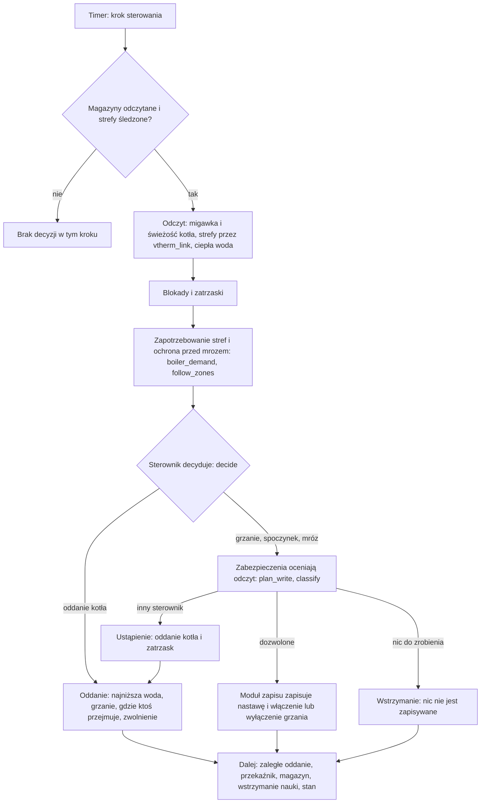

[English version](../en/technical.md)

# Smart Boiler for Versatile Thermostat — dokumentacja techniczna

> **W trakcie budowy, bez wydania.** Integracja nie pracowała jeszcze z prawdziwym kotłem.

Ten dokument opisuje budowę integracji: jej części, jeden krok sterowania, cykl życia, to, co
zapisuje, i sposób testowania. Co integracja robi dla użytkownika, opisuje
[przewodnik użytkownika](user-guide.md); wszystkie zasady i decyzje są w
[`SCOPE.md`](../../SCOPE.md) (po angielsku). Skróty: Home Assistant (HA), Versatile Thermostat
(VT), OpenTherm Gateway (OTGW), Message Queuing Telemetry Transport (MQTT).

## Spis treści

1. [Przegląd](#1-przegląd)
2. [Struktura repozytorium](#2-struktura-repozytorium)
3. [Zadania komponentów](#3-zadania-komponentów)
4. [Jeden krok sterowania](#4-jeden-krok-sterowania)
5. [Cykl życia](#5-cykl-życia)
6. [Stan trwały](#6-stan-trwały)
7. [Testowanie](#7-testowanie)

## 1. Przegląd

Integracja (domena `vtherm_smart_boiler`) jest wtyczką VT. Zastępuje kocioł centralny VT
działający w trybie wł./wył.: czyta strefy VT, decyduje, kiedy kocioł grzeje i jak ciepła jest
jego woda, zapisuje to do kotła i oddaje kocioł przy każdym wyjściu.

- **Czysta logika w `core/`.** Każde prawo sterowania i uczenia, analiza monitora i werdykt to
  czysty Python bez importów HA — test parsuje importy `core/`, żeby to wymusić. Ten sam rdzeń
  działa w testach jednostkowych, w symulatorze i w HA.
- **Strona HA** wokół niego zbiera dane wejściowe z encji wybranych przez użytkownika, uruchamia
  rdzeń na timerach i przy zmianach stanu, wykonuje jego zapisy i publikuje czujniki, czujniki
  binarne, przełączniki, przyciski i zgłoszenia w Naprawach.
- **`vtherm_link.py` to jedyne wejście do danych stref.** Czyta encje klimatu VT i centralną
  konfigurację VT oraz wykrywa, co jest zainstalowane (VT i jego wersję, `vtherm_api`,
  SmartPI), zamiast to zakładać. Żaden inny moduł nie odczytuje stanu strefy po nazwie encji.
- **Moduł funkcji (feature manager) zarejestrowany w VT** (`feature_manager.py`, przez
  `register_feature_manager` z `vtherm_api`) pokazuje dwie wartości stref wtyczki na każdym
  termostacie VT. Jest rejestrowany dopiero po wczytaniu VT; termostat, który już działa, widzi
  go dopiero po następnym przeładowaniu VT, którego wtyczka nigdy sama nie wywołuje. Nic w
  sterowaniu od niego nie zależy.

Szczegóły: [`SCOPE.md`, §2](../../SCOPE.md#2-why-a-plugin) i
[§5](../../SCOPE.md#5-hardware-circuits-and-zone-algorithms).

## 2. Struktura repozytorium

```text
custom_components/vtherm_smart_boiler/   integracja (strona HA)
├── core/                                 czysta logika, bez importów HA
├── transport/                            odczyt encji kotła i moduły zapisu
└── translations/                         en.json (źródło) i inne języki
tests/                                    testy: core/, integration/, sim/, tools/ i reszta
sim/                                      symulator fizyki i jego komponenty HA tylko do testów
tools/                                    import historii z recordera do analizy offline
devenv/                                   testowy HA (Docker compose) do scenariuszy odbiorczych
scripts/                                  env.sh (uruchamia każde polecenie w projekcie), deploy
```

- `sim/custom_components/` zawiera `boiler_sim` (symulowany kocioł, pomieszczenia i pogodę) oraz
  zastępczy `opentherm_gw`, oba tylko do testów.
- `tools/import_history.py` zamienia kopię bazy recordera HA na historię rdzenia, żeby analizę
  monitora można było sprawdzić na zapisanych danych.

## 3. Zadania komponentów

**Konfiguracja wpisu (`__init__.py`).** Czyta opcje wpisu do `EntryConfig`, buduje koordynator
i jednostkę sterowania, dołącza koordynator do modułu funkcji, a przy wyładowaniu najpierw
zatrzymuje jednostkę sterowania (oddaje ona kocioł), a koordynator na końcu. HA jest
importowany tylko wewnątrz funkcji.

**Koordynator (`coordinator.py`, `SmartBoilerCoordinator`).** Śledzi wskazane encje, trzyma
historię kroczącą i wylicza to, co publikują encje. Szybka ścieżka działa przy zmianach stanu i
co 30 sekund (odczyty, sprawdzenie sygnałów, ciepła woda, bieżące alarmy); analiza
(`core/analysis.py`) działa co kilka minut na kopii historii, poza pętlą zdarzeń. Koordynator
zarządza też magazynami (zobacz [Stan trwały](#6-stan-trwały)).

**Monitor i analiza (`core/monitor.py`, `core/analysis.py`, `core/verdict.py`).** Od historii do
cykli pracy palnika, metryk, ostrzeżeń o trendach, raportu i werdyktu sterowania, zawsze z
powodami. `core/alarms.py` zawiera alarmy monitora, z histerezą, żeby nie migotały.

**Jednostka sterowania (`control.py`, `ControlUnit`).** Strona HA sterowania: krok sterowania co
kilka sekund, jego zapisy przez moduł zapisu, oddanie kotła przy każdym wyjściu, wstrzymywanie
nauki algorytmów stref i stan pokazywany przez encje. Zamienia zdarzenia zabezpieczeń i awarie
na alarmy. Moduł zapisu istnieje tylko wtedy, gdy sterowanie jest włączone. Błąd wewnętrzny
oddaje kocioł i blokuje sterowanie zatrzaskiem.

**Krok sterowania (`core/loop.py`, `loop_step`).** Jeden krok: od decyzji sterownika, przez
zabezpieczenia zapisu, do tego, co zostaje zapisane teraz. Ten sam krok napędza symulator i HA.
Przekaźnik ma własny krok (`core/relay.py`).

**Sterownik (`core/controller.py`, `decide`).** Maszyna stanów, która zamienia to, co wtyczka
wie, na polecenie dla kotła, w stałej kolejności pierwszeństwa: sterowanie wyłączone; zatrzask
albo alarm ustawiony na oddanie kotła; brakujący warunek wstępny (blokada); utracona albo
nieświeża łączność z kotłem; usterka samego kotła; w pozostałych przypadkach włączenie lub
wyłączenie grzania z ochrony przed mrozem i zapotrzebowania stref, a temperatura wody z krzywej
(`core/curve.py`), limitów i rampy.

**Zapotrzebowanie (`core/demand.py`, `boiler_demand`).** To, o czym decydował kocioł centralny
VT, teraz zadanie wtyczki: strefy potrzebujące ciepła, łączna moc albo otwarcie zaworów, przy czym
każda strefa liczy się tylko wtedy, gdy VT podaje jej stan jednoznacznie.

**Pilnowanie stref (`core/zone_watch.py`, `follow_zones`).** Okres rozpoznania po starcie
(najwyżej 10 minut), okres przejściowy każdej strefy i przypadek, gdy wszystkie strefy są
nieznane.

**Zabezpieczenia (`core/guards.py`, `plan_write`, `classify`).** Co naprawdę może zostać
zapisane, o cokolwiek prosi sterownik: nic do trwałej pamięci kotła, ogranicznik częstości
zapisów, powtórzenia tam, gdzie wartość wygasa. Oceniają odczyt zwrotny i przypisują zmianę,
której wtyczka nie zrobiła, do utraconego polecenia, wartości ignorowanej od początku, wartości
przyciętej albo innego sterownika.

**Przekaźnik (`core/relay.py`).** Kocioł wł./wył. przełączany przekaźnikiem: co jest do niego
zapisywane, co znaczy zgłaszany przez niego stan i czy kocioł pokazuje, że grzeje.

**Oddanie sterowania (`core/hand_back.py`).** Dowody oddania sterowania: co świadczy o
zwolnieniu, kiedy stała trzecia wartość oznacza, że cel trzyma inny sterownik, i kiedy zmiana
celu dwuwartościowego jest utraconym poleceniem. Jednostka sterowania zapisuje trzy części i
ponawia, aż zostaną potwierdzone.

**Moduły zapisu (`transport/writers.py`).** Jedyny kod, który zmienia kocioł: encja do zapisu,
OTGW przez `opentherm_gw` z HA, firmware OTGW przez MQTT albo przekaźnik. Każdy moduł zapisu zna
usługi, które może wywołać (test sprawdza listę); nieudany zapis zgłasza `WriteError` i nigdy
nie jest uznawany za wykonany. Odczyt kotła jest w `transport/entities.py`, który niczego nie
zapisuje.

**Konfiguracja (`config_flow.py`, `config.py`, `control_config.py`).** Formularze konfiguracji
i opcji oraz opcje sterowania jako obiekty rdzenia, z blokadami, które nie pozwalają ruszyć
sterowaniu. `repairs.py` zawiera przepływy napraw (na przykład potwierdzenie oddania kotła
zrobionego ręcznie).

## 4. Jeden krok sterowania

Timer uruchamia krok jednostki sterowania (`ControlUnit._async_step` w `control.py`). Czystą
częścią jest `loop_step` w `core/loop.py`, który wywołuje `decide` w `core/controller.py`, a
potem zabezpieczenia w `core/guards.py`.



- **Świeżość:** nic nie jest zapisywane bez świeżych danych kotła. Łączność jest oceniana w
  oknie (utracona, gdy nieświeże kroki pokryją 5 minut w ciągu 10; wraca po 60 sekundach
  świeżych danych).
- **Blokady i zatrzaski** idą przed zapotrzebowaniem: zatrzask albo alarm ustawiony na oddanie
  kotła oddaje kocioł, o cokolwiek proszą strefy.
- **Decyzja:** włączenie lub wyłączenie grzania jest ustalane w każdym kroku; temperatura wody
  co odstęp decyzji (domyślnie 5 minut) i od razu po końcu blokady albo usterki.
- **Zabezpieczenia** widzą odczyt zwrotny każdego zapisu; oddania kotła żadne zabezpieczenie
  nigdy nie wstrzymuje.
- **Dalsze kroki:** zaległe oddanie kotła jest ponawiane co minutę, aż zostanie potwierdzone;
  stan sterowania jest zapisywany od razu, gdy się zmieni (zobacz
  [Stan trwały](#6-stan-trwały)).

Szczegóły: [`SCOPE.md`, §7](../../SCOPE.md#7-features-by-stage).

## 5. Cykl życia

**Konfiguracja wpisu.** `async_setup_entry` czyta opcje; część sterowania, której nie da się
użyć, wyłącza tylko sterowanie, a nie cały wpis, więc monitor dalej działa, a zaległe oddanie
kotła i tak zostaje wysłane. Koordynator czyta swoje magazyny; jednostka sterowania ostrożnie
czyta stan sterowania (zobacz niżej) i, zanim cokolwiek innego może zawieść, raz próbuje oddać
kocioł, jeśli poprzednie uruchomienie zostawiło to jako zaległe (niepowodzenie zostaje zaległe i
jest ponawiane przez zegar). Potem startują koordynator i jednostka sterowania, jednostka
sterowania rejestruje swoje zadanie zamknięcia, a koordynator zostaje dołączony do modułu
funkcji.

**Okres rozpoznania.** Po starcie HA albo przeładowaniu VT strefy zgłaszają się jedna po
drugiej. Sterownik nie podejmuje nowych decyzji, dopóki każda strefa się nie zgłosi, najwyżej
przez 10 minut. Polecenie trzymane przed ponownym uruchomieniem jest zachowywane albo od razu
przywracane, jeśli nic tego nie zabrania; w przeciwnym razie najpierw kocioł jest oddawany. VT
może pokazywać termostat, którego nie uruchomił, jako „wyłączony”; nigdy nie jest to czytane
jako „brak zapotrzebowania”.

**Przeładowanie.** Zapisanie opcji przeładowuje integrację: jeśli sterowanie trzyma kocioł, jest
on oddawany i przejmowany ponownie (przekaźnik przechodzi w stan spoczynkowy i z powrotem).

**Zatrzymanie HA.** Oddanie kotła działa w zadaniu zamknięcia (`hass.async_add_shutdown_job`),
które HA uruchamia przed swoim zdarzeniem zatrzymania. Wszystkie zadania zamknięcia mają wspólny
limit 20 sekund, po którym HA anuluje te, które wciąż trwają; oddanie kotła jest zbudowane tak,
żeby się w nim zmieścić. Oddanie niepotwierdzone do tego czasu zostaje zaległe w magazynie
sterowania i jest ponawiane przy następnym starcie.

**Wyładowanie.** `async_unload_entry` najpierw zatrzymuje jednostkę sterowania (oddaje ona
kocioł), odłącza moduł funkcji, wyładowuje platformy, a na końcu zatrzymuje koordynator.

**Usunięcie.** Jeśli przy usuwaniu wpisu oddanie kotła wciąż jest zaległe, nie da się go już
ponowić: zgłoszenie w Naprawach, które przetrwa wpis, mówi użytkownikowi, żeby oddał kocioł
ręcznie.

## 6. Stan trwały

Sterowanie ma własny magazyn (`ControlStore` w `coordinator.py`), oddzielny od głównego magazynu
wpisu, który trzyma historię monitora i podsumowania dni.

- **Co trzyma:** czy sterowanie jest włączone, ostatnie polecenie i to, czy wtyczka steruje,
  zatrzaski i ich przyczyny, zaległe oddanie kotła i dowody zwolnienia, wstrzymania nauki,
  wartości bazowe, z którymi porównują zabezpieczenia, obserwacje przekaźnika i aktywne alarmy
  sterowania.
- **Zapisywane od razu:** każda zmiana, której awaria nie może zgubić — znacznik sterowania,
  zatrzask, zaległe oddanie kotła — jest zapisywana natychmiast i atomowo. Wynik każdego zapisu
  jest odnotowywany; nieudany zapis tworzy zgłoszenie w Naprawach (pełny dysk albo pamięć tylko
  do odczytu).
- **Czytane ostrożnie** (`async_read_control_state`): gdy magazynu nie da się odczytać (brak go,
  jest uszkodzony albo ma inny kształt), a opcje zawierają część sterowania, oddanie kotła liczy
  się jako zaległe, a kocioł jako trzymany, więc wtyczka dla bezpieczeństwa oddaje kocioł.

## 7. Testowanie

Trzy warstwy ([`PLAN.md`, „Test environment”](../../PLAN.md#test-environment)):

1. **Testy rdzenia** (`tests/core/`) — zwykły pytest, bez HA, bez sieci.
2. **Testy integracyjne** — `pytest-homeassistant-custom-component`: HA działa wewnątrz procesu
   testów; bez instancji, bez sieci. Ciągła integracja (CI) pobiera też VT 10.4.0 i SmartPI
   0.4.0 z ich tagów, więc testy z prawdziwym VT działają przy każdej zmianie.
3. **Testowy HA** — osobny kontener (`devenv/`) z wtyczką, VT, SmartPI i symulatorem, w którym
   scenariusze odbiorcze są uruchamiane, zanim cokolwiek trafi do prawdziwego kotła.

**Symulator** (`sim/simulator.py`, z `sim/custom_components/boiler_sim`) modeluje kocioł,
pomieszczenia i pogodę. Scenariusz ustala instalację, pogodę, pobory ciepłej wody i zawory
stref, a w każdym okresie sterowania może wywołać sterownik; polecenia docierają do
symulowanego kotła tak jak przez bramkę. Sterowanie jest testowane tylko na symulatorze.

**Uruchamianie sprawdzeń**, tak jak opisuje [`CONTRIBUTING.md`](../../CONTRIBUTING.md), każde
przez `scripts/env.sh`:

```sh
scripts/env.sh python -m pytest -q -p no:homeassistant --disable-socket --allow-unix-socket \
    tests/core
scripts/env.sh python -m pytest -q --ignore=tests/core
scripts/env.sh ruff check .
scripts/env.sh ruff format --check .
scripts/env.sh mypy
```
