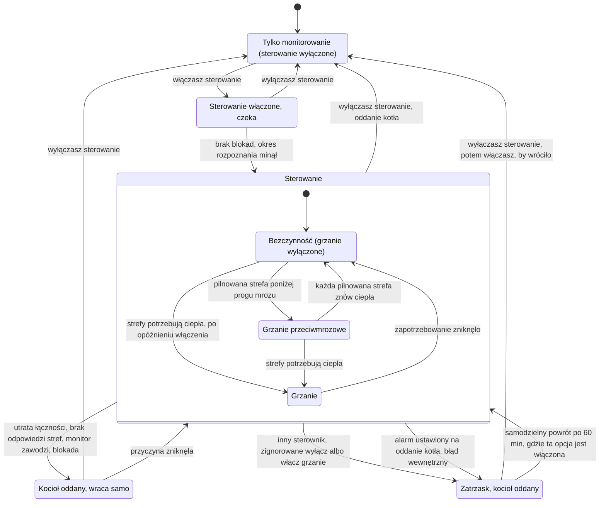

[English version](../en/user-guide.md)

# Smart Boiler for Versatile Thermostat — przewodnik użytkownika

> **W trakcie budowy, bez wydania.** Integracja nie pracowała jeszcze z prawdziwym kotłem. Nie ma
> wydania ani wpisu w Home Assistant Community Store (HACS). Nie instaluj jej w ogrzewaniu, na
> którym polegasz.

Smart Boiler for Versatile Thermostat to wtyczka (nie jest częścią VT ani dziełem jego autorów) do
Versatile Thermostat (VT), integracji Home Assistant, która steruje pomieszczeniami w domu. VT
decyduje, ile ciepła potrzebuje każde pomieszczenie. Ta wtyczka obserwuje kocioł centralnego
ogrzewania (gazowy, olejowy, elektryczny lub na inne paliwo; nie pompę ciepła), a gdy włączysz
sterowanie, decyduje, kiedy kocioł grzeje i jak ciepła jest jego woda. Nie steruje pomieszczeniami
ani zaworami.

Ten przewodnik jest streszczeniem. Specyfikacja, ze wszystkimi zasadami i decyzjami, to
[`SCOPE.md`](../../SCOPE.md) (po angielsku). Gdy oba teksty się różnią, rozstrzygają `SCOPE.md`
i teksty w formularzach samej integracji. Niektóre wartości w specyfikacji są wciąż oznaczone
jako „tymczasowe” (provisional): mogą się zmienić przed pierwszym wydaniem. Budowę wtyczki
opisuje [dokumentacja techniczna](technical.md).

## Spis treści

1. [Wymagania](#1-wymagania)
2. [Instalacja](#2-instalacja)
3. [Szybki start](#3-szybki-start)
4. [Jak to działa](#4-jak-to-działa)
5. [Podłączenie kotła](#5-podłączenie-kotła)
6. [Bezpieczeństwo i oddanie sterowania](#6-bezpieczeństwo-i-oddanie-sterowania)
7. [Alarmy i zgłoszenia w Naprawach](#7-alarmy-i-zgłoszenia-w-naprawach)
8. [Diagram stanów sterowania](#8-diagram-stanów-sterowania)

## 1. Wymagania

- **Home Assistant 2026.9 lub nowszy** — wersja, na której wtyczka jest testowana.
- **Versatile Thermostat 10.2.0 lub nowszy**, z termostatami (wtyczka nazywa je strefami)
  ustawionymi dla pomieszczeń ogrzewanych przez ten kocioł. VT wczytuje zewnętrzne moduły funkcji
  (feature managers) od wersji 10.2.0; testowana jest wersja 10.4.0. To minimum jest tymczasowe
  i zostanie potwierdzone przed pierwszym wydaniem.
- Biblioteka `vtherm_api` w wersji 0.5.0 lub nowszej. Home Assistant instaluje ją razem z
  wtyczką.
- **Kocioł, który Home Assistant potrafi odczytać**, przez dowolną integrację pokazującą jego
  sygnały jako encje: na przykład OpenTherm Gateway (OTGW), EMS-ESP albo sterownik OpenTherm na
  ESPHome. Kocioł, który ma tylko zaciski termostatu pokojowego wł./wył., można monitorować i
  przełączać przekaźnikiem.
- **Wskazane sygnały.** Dla każdego sygnału wybierasz encję, która go dostarcza; do
  monitorowania żaden nie jest wymagany. Płomień i temperatura zasilania włączają metryki
  palnika i łączność z kotłem, a sterowanie temperaturą wody wymaga obu. Każdy inny sygnał
  (temperatura powrotu, ciśnienie wody, modulacja, temperatura zewnętrzna, gazomierz i inne)
  włącza kolejne funkcje monitora.
- **Do sterowania:** sposób zapisu do kotła i sposób jego oddania (zobacz
  [Podłączenie kotła](#5-podłączenie-kotła)) oraz wyłączony własny kocioł centralny VT.

SmartPI i Auto-TPI z VT (samouczący się algorytm VT, sterujący proporcjonalnie do czasu) są
opcjonalne; wtyczka działa z każdym algorytmem stref VT.

## 2. Instalacja

**Nie ma jeszcze wydania**, więc dziś nie da się zainstalować integracji przez HACS.

Gdy wydanie się pojawi, będzie się instalować przez HACS jako niestandardowe repozytorium:

1. W HACS otwórz menu → **Niestandardowe repozytoria**, dodaj
   `https://github.com/Shadow-230/vtherm-smart-boiler` z typem **Integracja**.
2. Znajdź **Smart Boiler for Versatile Thermostat** w HACS i pobierz.
3. Uruchom ponownie Home Assistant.

**Instalacja ręczna** (gdy pojawi się wydanie): skopiuj folder
`custom_components/vtherm_smart_boiler/` z wydania do folderu `custom_components/` w konfiguracji
Home Assistant, a potem uruchom ponownie Home Assistant.

Może istnieć tylko jeden wpis integracji: obsługuje jeden kocioł.

## 3. Szybki start

1. **Przygotuj VT.** Ustaw termostaty VT dla pomieszczeń. Jeśli w VT jest skonfigurowany kocioł
   centralny, odznacz go w centralnej konfiguracji VT i uruchom ponownie Home Assistant, żeby
   tym samym kotłem nigdy nie sterowały dwa sterowniki. Monitorowanie działa i bez tego;
   sterowanie na to czeka.
   Jeśli centralną konfigurację VT tworzysz (albo zmieniasz) po uruchomieniu Home Assistant —
   nawet bez kotła centralnego — przed włączeniem sterowania uruchom Home Assistant ponownie
   jeden raz: do tego czasu sterowanie czeka, bo wtyczka nie wie, co VT w tym czasie uruchomił.
2. **Utwórz wpis.** Ustawienia → Urządzenia oraz usługi → Dodaj integrację →
   **Smart Boiler for Versatile Thermostat**. Pierwszy ekran pyta, **jak kocioł jest podłączony**
   (integracja OpenTherm Gateway, firmware OTGW przez MQTT, ESPHome OpenTherm, EMS-ESP, przekaźnik,
   moduł Wi-Fi kotła lub integracja producenta, inna encja do zapisu albo inna integracja, która
   tylko czyta), o **źródło ciepła** i **rodzaj kotła** (jednofunkcyjny albo dwufunkcyjny, z
   zasobnikiem ciepłej wody albo bez). Drugi pyta o **tryb sterowania** — pełne sterowanie,
   wł./wył., tylko temperatura pokoju (od wersji 0.3; do tego czasu monitorowanie) albo tylko
   monitorowanie — oraz, gdzie to ma sens, o kondensację i priorytet ciepłej wody. Żadna z tych
   odpowiedzi nie jest wybrana za Ciebie i żadna niczego nie włącza. Potem wybierz nazwę i poziom
   szczegółowości (poziom zmienia tylko to, co widzisz, nigdy działanie wtyczki). Te same ekrany
   otwierają opcje integracji, w pozycji **Kocioł, połączenie i tryb sterowania**. Co oznacza
   każde połączenie, opisuje [Podłączenie kotła](#5-podłączenie-kotła).
   Potem pojawia się **menu sekcji**, jak we własnym kreatorze VT: otwierasz sekcję, zatwierdzasz
   ją i wracasz do menu — nic jeszcze nie jest tworzone. Sekcja, która nie dotyczy Twojej
   instalacji, nie jest pokazywana: pokój odniesienia bez stref, progi monitora na poziomie
   prostym, sterowanie przy samym monitorowaniu. Menu mówi, które sekcje zostały do
   zatwierdzenia; **Konfiguracja niekompletna** otwiera pierwszą z nich albo krok z problemem do
   poprawienia, a **Utwórz** pojawia się, gdy każda pokazana sekcja jest zatwierdzona. Zamknięcie
   okna porzuca konfigurację.
3. **Wybierz sygnały.** W sekcji **Sygnały kotła** wybierz encję dla każdego sygnału, który masz —
   co najmniej płomień i temperaturę zasilania, jeśli chcesz sterować kotłem. Wtyczka tylko
   czyta te encje. Przy integracji OpenTherm Gateway i dokładnie jednej bramce jej encje kotła
   są wpisane za Ciebie do sprawdzenia. Przy firmware OTGW przez MQTT i przy EMS-ESP osobny krok
   pyta o tematy MQTT urządzenia (zobacz [Świeżość danych](#68-świeżość-danych)).
4. **Opisz instalację.** Sekcje **Kocioł**, **Obiegi grzewcze**, **Strefy VT** (z jednym
   krokiem **Strefa** dla każdej wybranej strefy), **Budynek** i **Pokój odniesienia** pytają o
   to, co wiesz. Nieznane wartości zostaw puste: wtyczka powie wtedy, czego nie może ocenić.
   Sekcja **Kocioł** pyta też o limity ciśnienia wody z instrukcji kotła i z zaworu
   bezpieczeństwa — pojawiają się, gdy w **Sygnały kotła** zmapujesz czujnik ciśnienia, tak jak
   limity spalin w **Progi monitora** pojawiają się z czujnikiem spalin; sekcja **Budynek** pyta o
   projektową temperaturę zewnętrzną, wspólną z krzywą grzewczą.
5. **Dni danych do werdyktu.** Na poziomie zaawansowanym sekcja **Progi monitora** zawiera
   **Dni danych do werdyktu** (domyślnie 7, od 7 do 60). Można je też zmienić później w opcjach,
   w tej samej sekcji. Niczego nie wstrzymują: sterowanie możesz ustawić i włączyć w każdej chwili. Dopóki
   tego nie zrobisz, wtyczka nic nie zapisuje do kotła.
6. **Przeczytaj werdykt.** Gdy zbierze tyle dni danych, czujnik **Werdykt sterowania** mówi, czy
   warto włączyć sterowanie (zobacz [Monitorowanie i werdykt](#41-monitorowanie-i-werdykt)).
   Decyzja należy do ciebie.
7. **Ustaw sterowanie.** Przy pełnym sterowaniu albo wł./wył. menu kreatora pokazuje też sekcję
   **Sterowanie (eksperymentalne)**: ścieżka zapisu, potem kolejne kroki (na przykład **Krzywa
   grzewcza i limity** oraz **Zachowanie sterowania**). Żeby ustawić je później albo zmienić,
   otwórz tę samą sekcję w opcjach integracji. „Bez sterowania” zostawia samo monitorowanie.
8. **Włącz sterowanie** przełącznikiem **Sterowanie (eksperymentalne)** na urządzeniu
   integracji. Jeśli czegoś brakuje, przełącznik mówi czego, a monitor dalej działa.

**Późniejsze zmiany ustawień.** Opcje integracji otwierają to samo menu. Każda sekcja do niego
wraca i nic nie jest zapisywane do czasu **Zapisz i zakończ**: sprawdza ono całość, zapisuje ją
i raz przeładowuje integrację — gdy sterowanie trzyma kocioł, zostaje on oddany i przejęty
ponownie (przekaźnik przechodzi w stan spoczynkowy i z powrotem); sama zmiana poziomu niczego
nie przeładowuje. Menu wymienia sekcje z niezapisanymi zmianami; zamknięcie okna je porzuca.
Problem znaleziony przy zapisie otwiera jego krok z powodem: popraw go i wybierz **Zapisz i
zakończ** jeszcze raz. Zmiana, która zatrzymałaby sterowanie, najpierw pyta; jeśli odmówisz,
wracasz do menu ze swoimi zmianami — możesz je poprawić albo porzucić, zamykając okno.

## 4. Jak to działa

Szczegóły każdej zasady są w specyfikacji:
[`SCOPE.md`, §7](../../SCOPE.md#7-features-by-stage) i
[§10](../../SCOPE.md#10-assess-alongside-control).

### 4.1 Monitorowanie i werdykt

Po dodaniu integracji wtyczka tylko obserwuje kocioł. Niczego nie zapisuje, a kocioł pracuje jak
dotąd — pod kotłem centralnym Versatile Thermostat, termostatem ściennym albo własną automatyką —
dopóki nie włączysz sterowania, co możesz zrobić od pierwszego dnia. Rejestruje na przykład:

- cykle pracy palnika i ich długość oraz to, jak często kocioł startuje;
- przez jaką część czasu kocioł kondensuje (jeśli wskażesz potrzebne do tego sygnały);
- pobory ciepłej wody i zużycie gazu na stopniodzień (mierzone gazomierzem, który wskażesz,
  w przeciwnym razie szacowane);
- problemy z sygnałami, które czyta.

Werdykt potrzebuje domyślnie **7 dni danych**. Możesz zażądać więcej (do 60 dni), ale nie mniej.
Liczą się dni kalendarzowe od dnia utworzenia wpisu.

Potem czujnik **Werdykt sterowania** pokazuje jedną z wartości:

| Werdykt | Znaczenie |
|---|---|
| Warto włączyć | wtyczka zobaczyła problemy, które jej sterowanie zmienia, na przykład krótkie cykle pracy palnika |
| Nie warto włączać | zmierzono dość, a sterowanie niewiele by zmieniło |
| Jeszcze za mało danych | zmierzono za mało, żeby ocenić |

Werdykt jest radą. Decyzja należy do ciebie. Zanim się pojawi, a poza sezonem grzewczym także
wtedy, gdy dni miną bez wystarczających danych, przełącznik sterowania mówi, że sterowanie ruszy
bez werdyktu.

### 4.2 Sterowanie włączasz sam

Sterowanie jest **domyślnie wyłączone**. To przełącznik **Sterowanie (eksperymentalne)**.
Możesz go włączyć od pierwszego dnia, gdy wypełnione są wszystkie wymagane ustawienia, na
przykład:

- tryb sterowania „pełne sterowanie” albo „wł./wył.” (tylko monitorowanie i tylko temperatura
  pokoju zostawiają sterowanie wyłączone, a przełącznik mówi dlaczego);
- sposób zapisu do kotła i sposób jego oddania (zobacz
  [Podłączenie kotła](#5-podłączenie-kotła)), pasujące do połączenia kotła;
- projektowa temperatura zasilania krzywej grzewczej (nie ma wartości domyślnej);
- dokładnie jeden obieg grzewczy zasilany wprost z kotła (albo przez stały termostatyczny zawór
  mieszający);
- własny kocioł centralny VT wyłączony w VT, a po tym ponowne uruchomienie Home Assistant, żeby
  tym samym kotłem nigdy nie sterowały dwa sterowniki. Centralna konfiguracja VT utworzona lub
  zmieniona po uruchomieniu Home Assistant, nawet bez kotła centralnego, też wymaga tego jednego
  ponownego uruchomienia.

Gdy czegoś brakuje, przełącznik sterowania mówi czego. Monitor dalej działa, a kocioł zostaje
przy własnym sterowaniu albo przy swoim termostacie.

### 4.3 Kiedy grzanie się włącza i wyłącza

Wtyczka zastępuje kocioł centralny VT. O włączeniu lub wyłączeniu grzania decyduje na podstawie
stref VT, tak samo jak kocioł centralny VT. Wybierasz jedno lub więcej z tych kryteriów:

| Kryterium | Grzanie jest włączone, gdy |
|---|---|
| Strefy potrzebujące ciepła | ciepła potrzebuje co najmniej ustawiona liczba stref (domyślnie 1) |
| Łączna moc | łączna moc stref osiąga ustawiony próg |
| Otwarcie zaworów | otwarcie zaworów stref potrzebujących ciepła osiąga ustawiony próg |

- Decyzja jest sprawdzana co 10 sekund i działa od razu, w obie strony.
- VT liczy urządzenia grzewcze; ta wtyczka liczy **strefy**. Jeśli przechodzisz z kotła
  centralnego VT, sprawdź tę liczbę.
- Strefa się liczy tylko wtedy, gdy VT podaje jej stan jednoznacznie. Strefa niedostępna albo
  taka, której VT jeszcze nie uruchomił, ma stan „nieznany” — nigdy „brak zapotrzebowania”.
- Tryb centralny VT (Auto, Zatrzymany, Tylko grzanie, Tylko chłodzenie, Ochrona przed mrozem)
  działa przez strefy. Gdy wszystkie strefy są zatrzymane, nic nie potrzebuje ciepła, więc
  kocioł zostaje wyłączony. „Zatrzymany” w VT nie oddaje kotła; ochrona przed mrozem dalej
  czuwa.
- Wtyczka nie ma przełącznika lato/zima. Jeśli strefy VT są wyłączone, kocioł nie grzeje.

### 4.4 Temperatura wody

Gdy grzanie jest włączone, wtyczka ustawia temperaturę wody w kotle (temperaturę zasilania):

1. **Krzywa grzewcza** — wpisujesz ją sam: projektową temperaturę zewnętrzną (domyślnie
   −15 °C), projektową temperaturę zasilania (wymagana, bez wartości domyślnej) i opcjonalne
   przesunięcie. Krzywa podaje temperaturę wody dla każdej temperatury zewnętrznej.
   **Temperatura pokojowa krzywej** (poziom zaawansowany): **Auto** (domyślnie) idzie za
   najwyższą nastawą spośród stref, które teraz grzeją — najcieplejszym pokojem, jaki
   utrzymujesz — najwyżej 23 °C, i za presetami VT (eco w nocy ją obniża); możesz pominąć
   wybrane pokoje (łazienkę utrzymywaną cieplej). **Ręcznie** zostawia wpisaną wartość: nastawę
   najcieplejszego pokoju. Za niska zostawia pokoje zimne przy łagodnej pogodzie. Wpis ustawiony
   przed tą wersją działa ręcznie ze swoją wartością. Stan sterowania pokazuje używaną
   temperaturę (`curve_room`). Projektowa temperatura zewnętrzna to ta sama wartość co
   w danych budynku: zmiana w jednym kroku zmienia obie. Krok krzywej pokazuje też maksymalną
   nastawę c.o. kotła i maksymalną temperaturę zasilania pierwszego obiegu — obowiązuje najniższa
   z trzech wartości: tych dwóch i najwyższej temperatury wody.
2. **Najniższa temperatura wody** — krzywa nigdy nie schodzi poniżej niej. Domyślnie 20 °C
   (wartość tymczasowa). Przy zbyt niskiej kocioł może w łagodną pogodę raz po raz sam się
   wyłączać; w kotle niekondensacyjnym może dojść do kondensacji w przewodzie spalinowym. Weź tę
   wartość z instrukcji kotła. Monitor może zaproponować wyższą wartość, jeśli widzi wiele
   krótkich cykli pracy palnika; nic nie zmienia się samo.
3. **Najwyższa temperatura wody** — nigdy powyżej niej. Domyślnie 70 °C.
4. **Pułap pogodowy** (pokazywany jako „Zakres korekty”) — o ile cokolwiek może podnieść wodę
   ponad krzywą. Domyślnie 10 K (kelwinów, czyli różnicy temperatur).
5. **Maksimum obiegu** — „Maksymalna temperatura zasilania” każdego obiegu, na przykład dla
   ogrzewania podłogowego. Wtyczka nigdy nie prosi o więcej. Sam kocioł może ją nieco
   przekroczyć; opcjonalny alarm informuje, gdy zmierzone zasilanie długo jest za wysokie.

Temperatura wody zmienia się powoli (rampa, domyślnie 1 K na minutę). Domyślnie jest ustalana
na nowo co 5 minut (odstęp decyzji).

Gdy brakuje temperatury zewnętrznej, wtyczka używa encji pogody, potem przez 3 godziny trzyma
ostatnią znaną wartość, a następnie używa twojej nastawy awaryjnej albo punktu projektowego
krzywej. Awaria czujnika zewnętrznego nigdy nie oznacza zerowego grzania.

**Korekta komfortu** — **domyślnie włączona przy pełnym sterowaniu** (wpis ustawiony przed tą
wersją zachowuje to, z czym działał). Gdy pomieszczenie nie dochodzi do swojej nastawy mimo w
pełni otwartego zaworu, woda powoli rośnie ponad krzywą, do swojego limitu: domyślnie 3 K, na
poziomie zaawansowanym do 10 K, nigdy więcej niż 3 K na dobę. Dla pomieszczenia, którego SmartPI
jest w fazie nauki, „nie dochodzi” znaczy: poniżej nastawy + 0,5 K, gdzie SmartPI przestaje je
grzać. Nie rośnie, gdy kocioł startuje częściej niż wcześniej. Jedno niedogrzane pomieszczenie
liczy się jak każde inne, w tych granicach — woda nigdy nie idzie wyżej dla jednego pokoju. Po
trzech godzinach na limicie, gdy pomieszczenie nadal nie dochodzi do nastawy, korekta tam stoi,
a zgłoszenie w Naprawach podaje pomieszczenie i możliwe przyczyny: za niska krzywa grzewcza, za
mały grzejnik w tym pomieszczeniu albo pomieszczenie tracące ciepło (okno, nieszczelności) —
najpierw krzywą, gdy nie dochodzi większość pomieszczeń, najpierw grzejnik i straty ciepła, gdy
jedno. Koszt: więcej gazu i możliwie więcej startów palnika;
jej opis w formularzu wyjaśnia ryzyko przy strefach TPI w VT. Obserwuj starty i wyłącz ją, jeśli
rosną. Przycisk „Wyzeruj korektę komfortu” cofa ją do zera.

### 4.5 Ochrona przed mrozem

Ochrona przed mrozem grzeje nawet wtedy, gdy żadna strefa nie potrzebuje ciepła:

- Pilnuje wszystkich stref (domyślnie) albo jednej wybranej.
- Gdy pilnowana strefa spadnie poniżej **5 °C** (domyślnie), grzanie pracuje według krzywej,
  dopóki każda pilnowana strefa nie przekroczy **7 °C** (domyślnie).
- Grzeje tylko pomieszczenie, do którego ciepło może dotrzeć: VT podaje otwarty zawór albo
  włączone urządzenie. Jeśli VT trzyma zimne pomieszczenie zamknięte (termostat wyłączony,
  otwarte okno, tryb centralny „Zatrzymany”), wtyczka nie uruchamia dla niego kotła. Tworzy
  zgłoszenie w Naprawach, które wskazuje pomieszczenie i mówi, co zrobić — na przykład użyć
  presetu przeciwmrozowego VT zamiast „wyłączony”.
- Jeśli grzanie przeciwmrozowe trwa około 2 godzin, a pomieszczenie się nie ogrzewa, informuje o
  tym alarm. Grzanie nie jest z tego powodu zatrzymywane.

### 4.6 Opóźnienie włączenia z VT

Wtyczka zachowuje opóźnienie włączenia z VT: od 0 do 600 sekund, domyślnie 0. Jest dla wolnych
zaworów (na przykład głowic termoelektrycznych w ogrzewaniu podłogowym), żeby otworzyły się
przed startem kotła i jego pompy.

- Opóźnia tylko **włączenie**. Wyłączenie nigdy nie jest opóźniane.
- Odliczanie zaczyna się przy pierwszej prawdziwej potrzebie ciepła. Jeśli potrzeba zniknie i
  wróci w trakcie odliczania, odliczanie trwa dalej; na jego koniec kocioł startuje tylko wtedy,
  gdy zapotrzebowanie wciąż jest.
- Grzanie przeciwmrozowe też na nie czeka.
- Przy przejściu z VT wartość jest wstępnie wypełniona ustawieniem z VT, do twojego
  potwierdzenia.

### 4.7 Po ponownym uruchomieniu

**Okres rozpoznania.** Po starcie Home Assistant albo przeładowaniu VT wtyczka czeka, aż każda
strefa poda swój stan, najwyżej 10 minut. W tym czasie nie podejmuje nowych decyzji. Jeśli przed
ponownym uruchomieniem sterowała kotłem i nic się nie zmieniło, co by tego zabraniało,
zachowuje albo od razu przywraca swoje ostatnie polecenie (bez opóźnienia włączenia). Jeśli coś
się zmieniło, najpierw oddaje kocioł.

**Okres przejściowy.** Jeśli strefa staje się nieznana, gdy VT działa, jej ostatnia odpowiedź
jest zachowywana przez 10 minut. Potem strefa wypada, a decydują pozostałe. Strefa nieznana
przez 30 minut wywołuje alarm, bo ochrona przed mrozem jej nie widzi.

**Żadna strefa nie odpowiada.** Jeśli po tych okresach wszystkie strefy są nieznane albo żadne z
twoich kryteriów zapotrzebowania nie dostaje danych, nic nie może poprosić o ciepło:

| Twoja instalacja | Co się dzieje |
|---|---|
| Działający termostat albo regulator pokojowy (zobacz niżej) | kocioł jest mu oddawany |
| Brak działającego termostatu | wtyczka trzyma grzanie wyłączone; **nie** oddaje kotła |

W obu przypadkach od razu pojawiają się alarm („Sterowanie: żadna strefa nie odpowiada”) i
zgłoszenie w Naprawach. Sterowanie wraca samo, gdy strefa znów odpowie.

**Działający termostat** to jedno z:

- termostat OpenTherm podłączony do zacisków termostatu bramki;
- na ścieżce przez encję zaznaczona opcja „Kocioł ma własny regulator pokojowy”;
- na przekaźniku ta opcja razem ze stanem przekaźnika po oddaniu sterowania ustawionym na
  „włączony”.

**Termostat, którego VT nie uruchomił**, liczy się jako nieznany, nawet po okresie rozpoznania.
VT może pokazywać taki termostat jako „wyłączony”, dopóki go nie uruchomi. Wtyczka nie czyta tego
„wyłączony” jako „brak zapotrzebowania”.

### 4.8 Ciepła woda

Rodzaj kotła mówi, czy kocioł grzeje ciepłą wodę: jednofunkcyjny bez ciepłej wody,
jednofunkcyjny z zasobnikiem, dwufunkcyjny (ciepła woda przepływowa) albo dwufunkcyjny
z wbudowanym zasobnikiem. Dla każdego kotła, który grzeje ciepłą wodę, ekrany pytają, czy
**ciepła woda ma priorytet**:

- **Z priorytetem** (domyślnie) — gdy kocioł grzeje ciepłą wodę, pomieszczenia nie dostają
  ciepła. Tak jest zwykle w kotle dwufunkcyjnym i przy zasobniku ładowanym przez zawór
  trójdrogowy. Wtyczka wstrzymuje wtedy na czas poboru naukę SmartPI w strefach i liczy, że
  ciepło kotła nie trafia do pomieszczeń.
- **Bez priorytetu** — ciepła woda i ogrzewanie działają razem (zasobnik ładowany równolegle,
  bufor, kocioł dwufunkcyjny, który dzieli ciepło). Ciepła woda nie wstrzymuje wtedy nauki i nie
  liczy się jako ciepło, którego brakuje pomieszczeniom.

Zła odpowiedź albo niepotrzebnie wstrzymuje naukę, albo pozwala jej uczyć się z poborów, które
zabrały pomieszczeniom ciepło. Rozróżnianie, czy kocioł grzał dom, czy wodę, od niej nie zależy.

### 4.9 Otwarte okna

Otwarte okno wygląda jak za niska krzywa: pomieszczenie nie dochodzi do nastawy, choćby woda była
ciepła. Wtyczka wyłącza takie pomieszczenie z korekty komfortu:

- **Własne wykrywanie okna w VT** — czujnik okna albo automatyczne wykrywanie VT po szybkości
  zmian temperatury — jest odczytywane: pomieszczenie, które VT trzyma z powodu okna, jest
  pomijane. Dla stref bez czujnika włącz w VT automatyczne wykrywanie okna.
- **Własna straż wtyczki**, dla stref bez jednego i drugiego: pomieszczenie, którego temperatura
  spada o 0,5 K w ciągu 10 minut przy otwartym zaworze i płynącym cieple, ma prawdopodobnie
  otwarte okno. Czujnik binarny **Prawdopodobnie otwarte okno** to pokazuje i podaje
  pomieszczenie; korekta nie rośnie dla niego, dopóki pomieszczenie nie ogrzeje się o 0,2 K ponad
  najniższy odczyt, i przez co najmniej 30 minut. Nic innego się nie zmienia.
- Uchylone okno chłodzi powoli i nie jest tak rozpoznawane: pomieszczenie nie dochodzi do nastawy,
  a na limicie korekty jej ostrzeżenie wymienia ucieczkę ciepła wśród przyczyn.

## 5. Podłączenie kotła

Wtyczka czyta kocioł przez encje, które wybierasz w jej formularzach. Do sterowania potrzebuje
też sposobu **zapisu** do kotła — „ścieżki zapisu” — oraz sposobu oddania kotła jego własnemu
sterowaniu — **oddania sterowania**.

Szczegóły: [`SCOPE.md`, §5](../../SCOPE.md#5-hardware-circuits-and-zone-algorithms) i
[Gateway topology](../../SCOPE.md#gateway-topology).

Pierwszy ekran pyta, **jak kocioł jest podłączony**. Odpowiedź decyduje, co wtyczka może
zapisywać, jak oddaje kocioł i co proponują kroki sterowania:

| Połączenie | Co zapisuje wtyczka | „Wyłącz grzanie” | Oddanie sterowania | Gdy Home Assistant stanie |
|---|---|---|---|---|
| OpenTherm Gateway (integracja) | nastawę sterującą, powtarzaną co 30 s | wyłączone zezwolenie na grzanie w bramce | bezpieczne oddanie sterowania | bramka porzuca nastawę w ciągu minuty: termostat na bramce przejmuje kocioł; bez termostatu grzanie staje |
| Firmware OTGW przez MQTT | to samo, jako polecenia MQTT firmware'u | jak wyżej | jak wyżej | jak wyżej |
| ESPHome OpenTherm | liczbę nastawy i przełącznik grzania, oba trzymane przez ESP | wyłączony przełącznik grzania | wartość, którą podajesz (proponowane) | ESP trzyma ostatnią nastawę i grzanie do restartu, potem bierze swoje wartości startowe ([5.7](#57-esphome-opentherm)) |
| EMS-ESP | swoją nastawę zasilania, która wygasa, powtarzaną co 30 s | nastawa 0 ([5.8](#58-ems-esp)) | limit czasu urządzenia, 1 minuta (proponowane) | nastawa wygasa w ciągu około minuty: kocioł wraca do własnego ustawienia |
| Przekaźnik (kocioł wł./wył.) | przekaźnik | przekaźnik wyłączony | jego stan spoczynkowy | przekaźnik zostaje, jak był |
| Moduł Wi-Fi kotła lub integracja producenta | domyślnie nic: monitorowanie | — | — | — |
| Inna encja do zapisu (zaawansowane) | to, co wybierasz, z podanym typem zapisu | przełącznik grzania | twój wybór | zależy od urządzenia |
| Inna integracja, tylko odczyt | nic | — | — | — |

Wartości w tej tabeli są tymczasowe do przeglądu przed wydaniem (K4). Sterowanie ustawione dla
innego połączenia jest zablokowane („Ustawione sterowanie nie pasuje do połączenia kotła”).
ESPHome i EMS-ESP to sterowniki po stronie Home Assistant: ich topologia to „wirtualna”. Moduły
Wi-Fi i integracje producentów zwykle zapisują do pamięci kotła albo przez chmurę, więc
sterowanie jest proponowane tylko z typem zapisu, który jest znany i nie jest trwały.

### 5.1 Ścieżki zapisu

Wybierasz jedną w kroku sterowania („Ścieżka zapisu”), spośród pasujących do połączenia kotła.
Domyślnie jest „Bez sterowania”: wtyczka tylko monitoruje.

- **Encja do zapisu** — interfejs kotła, który udostępnia encje z możliwością zapisu, na
  przykład EMS-ESP albo sterownik OpenTherm na ESPHome. Wtyczka zapisuje nastawę zasilania, a
  grzanie włącza i wyłącza przełącznikiem.
- **OpenTherm Gateway (OTGW)**, przez integrację Home Assistant `opentherm_gw`. Wtyczka zapisuje
  nastawę sterującą i włącza oraz wyłącza grzanie przez bramkę.
- **Firmware OTGW przez MQTT** (Message Queuing Telemetry Transport) — to samo, wysyłane jako
  polecenia MQTT firmware'u.
- **Przekaźnik (kocioł wł./wył.)** — dla kotła, który ma tylko zaciski termostatu pokojowego.
  Tylko włączanie i wyłączanie grzania.

Przełącznik włączania i wyłączania grzania jest w tej wersji **wymagany** do sterowania
temperaturą wody, poza EMS-ESP, gdzie grzanie wyłącza jego własna nastawa 0
([5.8](#58-ems-esp)). Bez niego sterowanie pozostaje zablokowane, a monitor działa.

#### Encja do zapisu

Wybierasz encję nastawy i przełącznik grzania oraz podajesz, jak każda z nich trzyma swoją
wartość („Typ zapisu”):

| Typ zapisu | Znaczenie | Co robi wtyczka |
|---|---|---|
| Wygasający | urządzenie porzuca wartość, jeśli nie jest powtarzana | powtarza ją co 30 sekund |
| Trzymany przez urządzenie | urządzenie zachowuje ostatnią wartość | wysyła ją przy zmianie i co 5 minut |
| Trwały | wartość jest zapisywana w pamięci kotła | bez zapisu: sterowanie pozostaje wyłączone |
| Nieznany (domyślnie) | — | bez zapisu: sterowanie pozostaje wyłączone |

Wybierasz też **sposób oddania sterowania**:

- **Zapis wartości** — nastawa zapisywana przy oddaniu sterowania. Podajesz, co ona robi:
  „Wraca jego własne sterowanie” albo „Grzanie ustaje”. Ta sama liczba znaczy co innego na
  różnych urządzeniach, więc nie ma wartości domyślnej.
- **Limit czasu urządzenia** — urządzenie wraca do własnego sterowania, gdy wtyczka przestaje
  zapisywać. Wpisujesz limit czasu urządzenia (domyślnie 1 minuta, od 1 do 60).
- **Wyłączenie przełącznika** — przełącznik „sterowania zewnętrznego”, który oddaje sterowanie
  urządzeniu.

#### OpenTherm Gateway

Wtyczka wysyła nastawę sterującą i powtarza ją co 30 sekund, bo inaczej bramka ją porzuca.
„Wyłącz grzanie” to wyłączone zezwolenie na grzanie w bramce, trzymane i wysyłane ponownie przy
każdym powtórzeniu. Wtyczka nigdy nie zmienia trybu bramki.

### 5.2 Co oznacza oddanie sterowania

Przy każdym wyjściu — wyłączeniu sterowania, alarmie ustawionym na oddanie kotła, zatrzymaniu
Home Assistant, utracie łączności z kotłem, błędzie — wtyczka oddaje kocioł (zobacz
[Bezpieczeństwo i oddanie sterowania](#6-bezpieczeństwo-i-oddanie-sterowania)). Co dzieje się
potem, zależy od twojej instalacji:

| Instalacja | Po oddaniu sterowania |
|---|---|
| Bramka z termostatem OpenTherm | przejmuje termostat; grzanie trwa dalej |
| Bramka bez termostatu (samodzielna) | grzanie **ustaje**, dopóki sterowanie nie wróci albo ty nie zadziałasz |
| Encja do zapisu, wartość „Wraca jego własne sterowanie” | grzeje własne sterowanie kotła |
| Encja do zapisu, wartość „Grzanie ustaje” | grzanie **ustaje**, dopóki sterowanie nie wróci |
| Przekaźnik, „Przekaźnik po oddaniu sterowania” = wyłączony (domyślnie) | brak ciepła, chyba że woła równoległy termostat |
| Przekaźnik, „Przekaźnik po oddaniu sterowania” = włączony | kocioł grzeje według własnego pokrętła albo termostatu |

Po oddaniu sterowania albo gdy Home Assistant nie działa, obowiązuje maksymalna temperatura wody
ustawiona w kotle (albo w termostacie ściennym), a nie we wtyczce. Tam też ustaw limit dla
niezmieszanego obiegu podłogowego.

Przełącznik sterowania pokazuje, co oddanie sterowania robi w twojej instalacji („Po oddaniu
sterowania”).

### 5.3 Sposób podłączenia bramki

Podajesz, jak bramka jest podłączona („Podłączenie bramki”); Home Assistant nie potrafi tego
odczytać.

| Podłączenie bramki | Co wtyczka może robić |
|---|---|
| Bramka z termostatem | sterować; oddanie sterowania zwraca kocioł termostatowi |
| Bramka bez termostatu (samodzielna) | sterować; oddanie sterowania zatrzymuje grzanie |
| Bramka w trybie monitora | tylko monitorować |
| Wirtualnie: sterownik po stronie Home Assistant | sterować przez encje tego sterownika |

Dla bramki formularz pyta też, **co jest podłączone do zacisków termostatu bramki**:

| Odpowiedź | Sterowanie |
|---|---|
| Termostat OpenTherm | dozwolone (z „Bramka z termostatem”) |
| Nic | dozwolone (z bramką samodzielną) |
| Styk wł./wył. (dwa przewody) | **zablokowane**: tylko monitorowanie |
| Nie wiem | **zablokowane**, dopóki nie sprawdzisz |

Dlaczego styk wł./wył. blokuje sterowanie: bramka zachowuje „wyłącz grzanie” wtyczki nawet po
końcu nadpisania. Gdyby Home Assistant się zawiesił, gdy grzanie było wyłączone, termostat wł./wył.
na bramce nie mógłby potem ogrzać domu. Termostatu OpenTherm to nie dotyczy.

Co warto wiedzieć przy bramce:

- **Samodzielna:** jeśli Home Assistant stoi dłużej niż około minuty, nastawa wygasa i kocioł
  przestaje grzać. Po oddaniu sterowania przy bramce samodzielnej ochrona przed mrozem zależy od
  własnej ochrony kotła, jeśli ją ma.
- **Z termostatem:** gdy steruje wtyczka, ustawienie grzania termostatu ściennego i jego
  wyłącznik nic nie robią (jego ustawienia ciepłej wody dalej działają). Po oddaniu sterowania
  grzeje według własnego ustawienia i programu, więc trzymaj je na poziomie, który dom powinien
  dostać. Wtyczka ostrzega, gdy nastawa termostatu ściennego jest nieznana albo niższa niż 15 °C
  (jeśli wskażesz ten sygnał).
- Strefa VT zbudowana na własnej encji termostatu bramki jest odrzucana.

### 5.4 Przekaźnik (kocioł wł./wył.)

Przekaźnik to przełącznik albo encja termostatu kotła przełączana między grzaniem a wyłączeniem.
`input_boolean` (pomocnik Home Assistant) jest odrzucany, bo niczego nie potwierdza. Wtyczka
tylko włącza i wyłącza grzanie; nie ustawia temperatury wody.

Wtyczka nie potrafi odczytać własnych ustawień przekaźnika, więc formularz pyta o:

- potwierdzenie „to osobny styk przekaźnika, a nie ustawienie zapisywane w pamięci kotła” —
  bez niego sterowanie nie ruszy;
- jego stan po zaniku zasilania, jego własny wyłącznik czasowy i to, czy zgłasza swój
  rzeczywisty stan (każde domyślnie „Nie wiem”, traktowane ostrożnie);
- odstęp powtórzeń (od 10 do 300 sekund, domyślnie 300);
- „Przekaźnik po oddaniu sterowania”: wyłączony (domyślnie) albo włączony.

Teksty formularza zalecają: przekaźnik na zaciskach termostatu pokojowego kotła, nigdy w jego
zasilaniu; stary termostat zostawiony równolegle i ustawiony nisko; przekaźnik startujący jako
„wyłączony” po zaniku zasilania; jedną próbę latem.

Przekaźnik poza zasięgiem wywołuje alarm po 5 minutach. Wtedy nie ma oddania sterowania, bo nic
nie dotarłoby do przekaźnika; polecenie jest wysyłane ponownie, gdy wróci.

### 5.5 Opcja „Kocioł ma własny regulator pokojowy”

Zaznacz ją tylko wtedy, gdy kocioł ma własny regulator pokojowy, który sam prosi o ciepło, gdy
wtyczka go puści — na przykład panel pokojowy na magistrali kotła. Domyślnie jest wyłączona.

- Na encji do zapisu: gdy VT w ogóle nie odpowiada, kocioł jest oddawany temu regulatorowi i
  każde inne oddanie sterowania też trafia do niego.
- Na przekaźniku: liczy się tylko z „Przekaźnik po oddaniu sterowania” = włączony.
- Przy bramce nie jest oferowana: decyduje odpowiedź o zaciskach termostatu.

Bez tej opcji, gdy VT nie odpowiada, kocioł nie grzeje, a alarm i zgłoszenie w Naprawach mówią
dlaczego.

### 5.6 Nic nie trafia do trwałej pamięci kotła

Wtyczka zapisuje tylko wartości, które wygasają albo które urządzenie trzyma w pamięci
roboczej. Cel oznaczony jako trwały albo o nieznanym typie nigdy nie jest zapisywany: sterowanie
pozostaje wyłączone i mówi dlaczego. Parametry krzywej zapisane w kotle nigdy nie są
zapisywane. Wtyczka zostawia też zezwolenie na ciepłą wodę w kotle tak, jak było.

### 5.7 ESPHome OpenTherm

ESP z komponentem OpenTherm ESPHome jest dla kotła sterownikiem nadrzędnym: cały czas wysyła
ostatnią nastawę i ostatnie „grzej / nie grzej”, które dostał. Gdy Home Assistant stanie, ESP
trzyma je do swojego restartu — domyślnie 15 minut po ostatnim połączeniu z Home Assistant (jego
`reboot_timeout` API) — a potem bierze wartości startowe z własnej konfiguracji. Dlatego
sterowanie przez ESPHome wymaga zaznaczenia **„W ESP: bezpieczne wartości startowe i krótki
reboot_timeout API”**; wtyczka nigdy nie zaznacza tego za Ciebie. Bez tego sterowanie nie rusza
(„Nie potwierdzono bezpiecznego startu ESP”).

Szkic części, które mają znaczenie — sprawdź nazwy w
[dokumentacji OpenTherm ESPHome](https://esphome.io/components/opentherm/) dla swojej wersji
i wpisz własne piny i nazwy:

```yaml
api:
  reboot_timeout: 5min        # restart i wartości startowe niżej wkrótce po zniknięciu
                              # Home Assistant

opentherm:
  in_pin: GPIO_IN             # piny Twojej płytki
  out_pin: GPIO_OUT

number:
  - platform: opentherm
    t_set:
      name: "Boiler setpoint"
      min_value: 0
      max_value: 80
      initial_value: 0        # bez nastawy na starcie: kocioł nie dostaje prośby o grzanie
      restore_value: false    # nigdy ostatnia wartość sprzed restartu

switch:
  - platform: opentherm
    ch_enable:
      name: "Boiler heating"
      restore_mode: ALWAYS_OFF  # grzanie wyłączone na starcie

sensor:
  - platform: opentherm
    t_boiler:
      name: "Boiler flow temperature"
      force_update: true      # zgłaszaj też niezmienione wartości
    t_ret:
      name: "Boiler return temperature"
      force_update: true
    rel_mod_level:
      name: "Boiler modulation"
      force_update: true

binary_sensor:
  - platform: opentherm
    flame_on:
      name: "Boiler flame"
```

We wtyczce: liczba nastawy to encja nastawy, przełącznik grzania to przełącznik grzania; krok
sterowania proponuje dla obu „Trzymany przez urządzenie”, a oddanie sterowania „Zapis wartości”,
której wartość i skutek podajesz.

Przy takich wartościach startowych dom, w którym Home Assistant nie wraca po restarcie ESP, **nie
jest ogrzewany**, dopóki Home Assistant nie wróci. Alternatywą jest umiarkowany start:
przełącznik grzania włączony na starcie i `initial_value` o umiarkowanej temperaturze wody, na
przykład 45 °C. Kocioł grzeje wtedy bez żadnej regulacji pokojowej — pomieszczenia mogą się
przegrzać, a ogrzewanie podłogowe potrzebuje własnego ogranicznika — dopóki Home Assistant nie
wróci. Wybierz to, co jest bezpieczniejsze w Twoim domu.

`force_update: true` ma znaczenie dla świeżości danych: Home Assistant zapisuje wartość czujnika
ESPHome tylko wtedy, gdy się zmienia, chyba że ESP wysyła ją z `force_update`. Bez tego wtyczka nie
odróżni wartości stałej od zamrożonej. Jeśli czujnik liczbowy przez pierwsze sześć godzin nie
powtórzył niezmienionej wartości, zgłoszenie „Czujniki ESPHome nie powtarzają niezmienionych
wartości” wymienia go z nazwy. Czujniki binarne (płomień) nie mogą powtarzać wartości; liczy się
dla nich dostępność.

### 5.8 EMS-ESP

Nastawa zasilania EMS-ESP (`selflowtemp`) wygasa w ciągu około minuty, a EMS-ESP jej nie powtarza,
więc wtyczka zapisuje ją co 30 sekund. Wybierz ją jako encję nastawy i jako jej odczyt zwrotny.
Krok sterowania proponuje dla niej „Wygasający”, a oddanie sterowania „Limit czasu urządzenia”
równy 1 minucie: wtyczka przestaje zapisywać, a kocioł w ciągu około minuty wraca do własnego
ustawienia.

- **„Wyłącz grzanie” to nastawa 0** — sposób, który opisuje sama dokumentacja EMS-ESP („Force
  Heating Off”) — zapisywana co 30 sekund jak każda nastawa, i tylko przy nastawie pozostawionej
  jako „Wygasający”: wtedy zatrzymany Home Assistant zostawia kocioł jego własnemu sterowaniu
  w ciągu około minuty. Przełącznik grzania nie jest przy tym połączeniu potrzebny; nigdy nie
  używaj do tego „heating activated” z EMS-ESP — kocioł zapisuje je w swojej pamięci. Co robi
  pompa kotła przy nastawie 0, nie wiadomo: obserwuj to na swoim kotle.
- Jeśli kocioł od początku ignoruje 0, sterowanie staje i oddaje kocioł; przełącznik sterowania
  podaje wtedy: Kocioł nie przyjął „wyłącz grzanie”: wyłącz i włącz sterowanie.
- Kocioł przyjmuje nastawę z magistrali tylko poniżej ustawienia na własnym panelu (dokumentacja
  EMS-ESP). Ustaw własną temperaturę grzania kotła co najmniej na najwyższą temperaturę wody we
  wtyczce; inaczej wyższe nastawy nie są przyjmowane, a wtyczka to zgłasza.
- Dla świeżości danych wtyczka słucha powtórzeń EMS-ESP w jego temacie bazowym MQTT (zobacz
  [Świeżość danych](#68-świeżość-danych)).

## 6. Bezpieczeństwo i oddanie sterowania

Ta część wyjaśnia, jak wtyczka oddaje kocioł, jak reaguje, gdy coś innego zmienia kocioł, i jak
sterowanie wraca po zatrzymaniu.

Szczegóły: [`SCOPE.md`, §5](../../SCOPE.md#5-hardware-circuits-and-zone-algorithms)
(bezpieczne oddanie sterowania) i [§7](../../SCOPE.md#7-features-by-stage) (podstawa
sterowania).

### 6.1 Bezpieczne oddanie sterowania

Wtyczka oddaje kocioł przy **każdym wyjściu**, na przykład gdy:

- wyłączasz sterowanie albo usuwasz lub przeładowujesz integrację;
- zadziała alarm ustawiony na oddanie kotła;
- Home Assistant się zatrzymuje;
- łączność z kotłem jest utracona przez 5 minut;
- własny monitor wtyczki zawodzi przez 5 minut;
- wystąpi błąd wewnętrzny;
- wtyczka ustępuje innemu sterownikowi.

Oddanie sterowania ma trzy części, wysyłane od razu jedna po drugiej, każda próbowana
niezależnie od pozostałych:

1. woda ustawiona na najniższą temperaturę wody;
2. grzanie włączone tam, gdzie przejmuje termostat albo własne sterowanie kotła;
3. zwolnienie: na bramce kasowane jest nadpisanie; na encji — wartość oddania, wyłączenie
   przełącznika sterowania zewnętrznego albo limit czasu urządzenia.

Przekaźnik zamiast tego przechodzi w swój stan „Przekaźnik po oddaniu sterowania”.

Oddanie sterowania jest **ponawiane co minutę, aż zostanie potwierdzone**, a wtyczka pamięta o
nim po ponownym uruchomieniu. Dopóki jest zaległe, mówi o tym zgłoszenie w Naprawach. Jeśli
ręcznie przywrócisz kotłu własne sterowanie, możesz to potwierdzić w tym zgłoszeniu, a wtyczka
przestanie ponawiać.

Stała inna wartość w odczycie zwrotnym nastawy po oddaniu liczy się jako wartość innego
sterownika („Po oddaniu kotłem steruje inny sterownik”) dopiero wtedy, gdy wartość oddania
dotarła do nastawy. Jeśli od tego czasu urządzenie się zrestartowało albo jego encje były
niedostępne, ta wartość jest jego własną wartością startową: oddanie zostaje zaległe, pokazane
jako nieudane, i jest wysyłane ponownie.

Co kocioł robi po oddaniu sterowania, zależy od twojej instalacji: zobacz
[Co oznacza oddanie sterowania](#52-co-oznacza-oddanie-sterowania).

### 6.2 Zmiany z zewnątrz

Każdy zapis jest odczytywany z powrotem. Wtyczka pokazuje wartość potwierdzoną przez kocioł albo
„nieznana” — nigdy wartość, o którą prosiła. Gdy odczyt zwrotny pokazuje coś, czego wtyczka nie
zapisała, przypisuje to do jednego z czterech rodzajów:

- **Utracone polecenie** — kocioł wrócił do wartości sprzed, po przerwie w działaniu albo
  ponownym uruchomieniu. Wtyczka wysyła polecenie jeszcze raz. Po 3 takich w ciągu 24 godzin —
  alarm informacyjny.
- **Ignorowane od początku** — kocioł nie przyjmuje wartości w pierwszych 3 próbach sesji.
  Wtyczka przestaje wysyłać tę wartość do końca sesji i informuje cię (zobacz niżej).
- **Przycięte** — zawsze ta sama niższa wartość, cokolwiek zostanie wysłane. Wtyczka przyjmuje
  ją jako własny limit kotła; tylko informacja.
- **Inny sterownik** — stała wartość, której wtyczka nie zapisała. Wtyczka raz zapisuje swoją
  wartość z powrotem; druga zmiana w ciągu 24 godzin sprawia, że ustępuje.

**Wtyczka nigdy nie walczy z innym sterownikiem.** Gdy ustępuje, wykonuje pełne bezpieczne
oddanie sterowania i pozostaje wyłączona („zatrzask”), dopóki nie wyłączysz i nie włączysz
sterowania. Opcjonalny „samodzielny powrót” (domyślnie wyłączony, nie dla przekaźników) przejmuje
kocioł z powrotem po 60 minutach bez obcej wartości.

Jeśli kocioł od początku sesji ignoruje **„wyłącz grzanie” albo „włącz grzanie”** wtyczki,
sterowanie jest blokowane, a kocioł oddawany, z alarmem. Pozostaje zablokowane, dopóki nie
usuniesz przyczyny i nie wyłączysz i nie włączysz sterowania.

Jeśli odczyt zwrotny przez 5 minut pokazuje inną nastawę, pojawiają się alarm „brak
potwierdzenia z kotła” i zgłoszenie w Naprawach. Samo to nigdy nie oddaje kotła.

### 6.3 Utrata łączności z kotłem

Wtyczka nic nie zapisuje bez świeżych danych. Gdy odczyt płomienia albo zasilania nie jest
świeży przez 5 minut w ciągu ostatnich 10, łączność jest utracona:

- pojawia się alarm „Sterowanie: utracono dane kotła”, a wtyczka oddaje kocioł;
- przy termostacie przejmuje termostat; przy bramce samodzielnej grzanie ustaje;
- sterowanie wraca samo, gdy dane są świeże przez 60 sekund bez przerwy.

Awaria czujnika zewnętrznego nie jest utratą łączności: wtyczka używa nastawy awaryjnej, nigdy
zerowego grzania.

### 6.4 Usterka samego kotła

Możesz wskazać własne sygnały usterek kotła: usterkę niskiego ciśnienia wody i inną usterkę,
która go zatrzymuje. Na OTGW usterka liczy się tylko wtedy, gdy jednocześnie włączona jest
„Fault indication” kotła, i ten sygnał też musi być wskazany.

Dopóki taka usterka pokazuje „włączony” przez 5 minut, wtyczka trzyma grzanie wyłączone — razem
z grzaniem przeciwmrozowym — bez oddania sterowania i bez zatrzasku. Grzeje znowu sama, gdy
tylko każda wskazana usterka pokaże „wyłączony” (albo stan nieznany). Odczytaj usterkę na
kotle i postępuj według jego instrukcji.

Niskie, wysokie albo spadające ciśnienie wody i gorące spaliny tylko informują, powiadomieniem,
które mówi, co zrobić. Uszkodzony czujnik ciśnienia nigdy nie zatrzymuje grzania.

### 6.5 Brak oznak, że kocioł grzeje

Blokada kotła, panel ustawiony na lato albo usterka gazu mogą sprawić, że każdy odczyt zwrotny
wygląda dobrze. Jeśli grzanie jest włączone, gdy pomieszczenie potrzebuje ciepła, a przez 30
minut płomień się nie pojawia (albo, bez sygnału płomienia, temperatura zasilania nie rośnie o
5 K), podczas gdy woda zostaje poniżej nastawy wtyczki, wtyczka zgłasza alarm „Sterowanie: brak
oznak grzania kotła” i zgłoszenie w Naprawach. To nigdy nie oddaje kotła: sterowanie trwa dalej.
Oba znikają przy pierwszej oznace ciepła albo gdy wyłączysz sterowanie.

### 6.6 Przekaźnik, który przestaje przyjmować polecenia

- **Poza zasięgiem** (niedostępny przez 5 minut): alarm i zgłoszenie w Naprawach; bez oddania
  sterowania; polecenie jest wysyłane ponownie, gdy przekaźnik wróci.
- **Nigdy nie przyjmuje polecenia** w pierwszych 3 próbach: zgłoszenie w Naprawach. Jeśli nie
  przyjmuje „wyłącz” albo „włącz”, sterowanie jest blokowane, a przekaźnik oddawany.
- **Przestaje przyjmować polecenia** w trakcie sesji (około 15 minut, trzy sprawdzenia):
  zgłoszenie w Naprawach. Jeśli nie przyjmuje „wyłącz”, sterowanie jest blokowane — kocioł może
  dalej grzać — a przekaźnik oddawany. Jeśli nie przyjmuje „włącz”, dom nie jest ogrzewany, a
  wtyczka dalej wysyła „włącz”.
- **Przełączany przez coś innego** (automatyzację, jego przycisk, człowieka): raz przełączany z
  powrotem; druga zmiana w ciągu 24 godzin sprawia, że wtyczka ustępuje.

### 6.7 Jak sterowanie wraca

| Dlaczego sterowanie stanęło | Sterowanie wraca |
|---|---|
| Alarm ustawiony na oddanie kotła | gdy wyłączysz i włączysz sterowanie (zatrzask) |
| Inny sterownik (wtyczka ustąpiła) | po wyłączeniu i włączeniu albo samo, gdzie „samodzielny powrót” jest włączony |
| Zignorowane „wyłącz grzanie” albo „włącz grzanie”; przekaźnik przestaje przyjmować „wyłącz” | po wyłączeniu i włączeniu, po usunięciu przyczyny |
| Błąd wewnętrzny | gdy wyłączysz i włączysz sterowanie |
| Inna wartość ignorowana od początku | w następnej sesji |
| Utracona łączność z kotłem | samo, po 60 sekundach świeżych danych |
| Przekaźnik poza zasięgiem | samo, gdy przekaźnik wróci |
| Usterka samego kotła | samo, gdy usterka zniknie |
| Żadna strefa nie odpowiada | samo, gdy strefa odpowie |
| Własny monitor wtyczki zawodzi | samo, gdy znów działa |
| Blokada: brakujące ustawienie, start Home Assistant | samo, gdy zniknie |

Wciąż skonfigurowany kocioł centralny VT też jest blokadą: sterowanie czeka, aż odznaczysz go w
VT i uruchomisz ponownie Home Assistant. Tak samo centralna konfiguracja VT utworzona lub zmieniona
po uruchomieniu Home Assistant (np. VT ustawiony już po starcie), nawet bez kotła centralnego:
wystarczy jedno ponowne uruchomienie Home Assistant.

Zatrzask przetrwa ponowne uruchomienie i jest wymieniony w jednym zgłoszeniu w Naprawach. Alarm
z reakcją „oddaj kocioł”, który jest już aktywny, gdy włączasz sterowanie, od razu blokuje
sterowanie.

### 6.8 Świeżość danych

Sygnał jest świeży, gdy jego encja jest dostępna i — jeśli ma limit wieku — gdy jego ostatnie
zgłoszenie mieści się w tym limicie. Bez świeżego płomienia i temperatury zasilania sterowanie nic
nie zapisuje i po pięciu minutach oddaje kocioł
([Utrata łączności z kotłem](#63-utrata-łączności-z-kotłem)). Limity ustawia się w opcjach,
w **Limity świeżości**, w minutach, osobno dla każdego sygnału i dla encji pogody:

- **Puste (domyślnie): automatycznie.** Bez limitu, dopóki źródło nie powtórzy niezmienionej
  wartości co najmniej dwa razy w tym uruchomieniu; potem pięciokrotność jego własnego rytmu,
  od 10 do 30 minut dla sygnałów kotła i od 3 do 12 godzin dla encji pogody. Źródło, które
  zgłasza tylko zmiany, nigdy go nie dostaje: stała wartość nie jest nieświeża, a limit
  zatrzymałby sterowanie przy stałej pogodzie.
- **0: bez limitu** — liczy się tylko, czy encja jest dostępna.
- **Liczba: ten limit.** Krótszy niż odstęp, w jakim źródło zgłasza wartości, robi ze stałej
  wartości nieświeżą.

Home Assistant zapisuje wartość encji MQTT i ESPHome tylko wtedy, gdy się zmienia, więc jej własny
czas zgłoszenia nic nie mówi o stałej wartości. Interfejsy same powtarzają swoje wartości —
firmware OTGW co najmniej co 60 sekund, EMS-ESP domyślnie co 10 sekund — i przy tych dwóch
wtyczka słucha wiadomości MQTT urządzenia (tylko czyta) i bierze je za zgłoszenia sygnałów.
O tematy pyta krok połączenia: główny temat i węzeł firmware'u OTGW albo temat bazowy EMS-ESP.
Gdy czas publikacji danych kotła w EMS-ESP wynosi 0 (tylko zmiany), nic się nie powtarza.
Przy ESPHome powtórzenia daje `force_update: true` na jego czujnikach
([5.7](#57-esphome-opentherm)). Integracja OpenTherm Gateway sama przepisuje swoje encje przy
każdym raporcie.

## 7. Alarmy i zgłoszenia w Naprawach

Wtyczka informuje o problemach na dwa sposoby:

- **Alarmy** to czujniki binarne na urządzeniu integracji. Większość tylko informuje. Sterowanie
  zmienia tylko kilka z nich, wymienionych w
  [Bezpieczeństwo i oddanie sterowania](#6-bezpieczeństwo-i-oddanie-sterowania).
- **Zgłoszenia w Naprawach** pojawiają się w Home Assistant w Ustawienia → System → Naprawy.
  Każde mówi, co się stało i co zrobić, i zamyka się samo, gdy przyczyna zniknie.

Alarm, którego dane wejściowe są nieznane, zachowuje swój ostatni stan przez 60 minut, a potem
pokazuje „nieznany”. Nieznana wartość nigdy nie wywołuje alarmu. Niektóre alarmy istnieją tylko
wtedy, gdy wskazane są potrzebne im sygnały. Poniższe nazwy są takie, jak pokazuje je Home
Assistant po polsku.

### 7.1 Kocioł i woda

Alarmy monitora. Informują; wtyczka dalej grzeje.

| Alarm | Znaczenie | Co zrobić |
|---|---|---|
| Niskie ciśnienie wody | poniżej ustawionego poziomu „uzupełnij wodę” | uzupełnij wodę zgodnie z instrukcją |
| Wysokie ciśnienie wody | powyżej ustawionego limitu | zobacz zgłoszenie w Naprawach niżej |
| Spadające ciśnienie wody | spada przez kilka dni, z uwzględnieniem temperatury wody | szukaj wycieku |
| Za gorące spaliny | powyżej ustawionego limitu | umów serwis kotła |
| Spaliny coraz cieplejsze od powrotu | spaliny cieplejsze od powrotu bardziej niż wcześniej | umów serwis |
| Częste starty | więcej startów w ostatniej godzinie niż limit | sprawdź krzywą i limity |
| Niestabilny zapłon | w ciągu doby wiele cykli pracy palnika gaśnie wkrótce po zapłonie | zleć sprawdzenie |
| Dryf histerezy c.o. | pasmo wł./wył. kotła z czasem się przesuwa | zleć sprawdzenie |
| Brak przepływu: wszystkie zawory zamknięte przy pracującej pompie | woda nie ma którędy płynąć | sprawdź zawory albo obejście (bypass) |
| Za gorąca woda w obiegu | zasilanie powyżej temperatury alarmowej obiegu | sprawdź jego maksimum |
| Długie palenie bez nagrzewania | płomień 3 h bez przerwy, a pomieszczenia się nie nagrzewają: przyczyna mówi, czy woda jest za chłodna dla niedogrzanych pomieszczeń, kocioł na granicy mocy, czy woda za ciepła | korekta podnosi za chłodną wodę; przy za ciepłej obniż krzywą |
| Prawdopodobnie otwarte okno | pomieszczenie straciło 0,5 K w 10 minut podczas grzania | zamknij okno; do tego czasu pomieszczenie jest pomijane w korekcie |

Zgłoszenia w Naprawach:

| Zgłoszenie | Znaczenie i co zrobić |
|---|---|
| Niskie ciśnienie wody w instalacji — uzupełnij wodę | uzupełnij wodę zaworem napełniającym, patrząc na manometr |
| Wysokie ciśnienie wody w instalacji | sprawdź, czy zawór napełniający jest zamknięty; spuszczaj wodę tylko na zimno |
| Ciśnienie wody w instalacji ciągle spada | ryzyko wycieku: szukaj kapiącej wody albo zleć sprawdzenie |
| Za gorące spaliny | umów serwis: wymiennik ciepła, przewód spalinowy, odprowadzenie kondensatu |
| Kocioł zgłasza usterkę, która go zatrzymuje | grzanie jest wyłączone, dopóki nie zniknie; zobacz instrukcję |
| Kocioł wciąż się wyłącza przy najniższej temperaturze wody | rozważ podniesienie tego limitu |
| Kocioł wciąż się wyłącza przy swojej najniższej temperaturze wody | to samo, na własnej krzywej urządzenia |
| Kocioł jest na granicy mocy | 3 h na wysokiej modulacji poniżej nastawy przy niedogrzanych pomieszczeniach: sprawdź ustawienie mocy grzania |

Dla ciśnienia twój limit alarmu musi być niższy niż ciśnienie zadziałania zaworu
bezpieczeństwa, wydrukowane na zaworze.

### 7.2 Sterowanie

Alarmy sterowania mają nazwy „Sterowanie: …”.

| Alarm | Znaczenie |
|---|---|
| Sterowanie: zapis nieudany | zapis nie przeszedł; jest wysyłany ponownie w każdym kroku |
| Sterowanie: kocioł nie przyjmuje polecenia — sprawdź ustawienia | wartość nigdy nie została przyjęta |
| Sterowanie: zmiana przez inny sterownik | coś innego zapisało do kotła |
| Sterowanie: oddanie nieudane | oddanie sterowania nie zostało potwierdzone |
| Sterowanie: błąd wewnętrzny | błąd we wtyczce zatrzymał sterowanie |
| Sterowanie: korekta komfortu na granicy | na swoim limicie (domyślnie 3 K) przez 3 godziny: zobacz jej zgłoszenie |
| Sterowanie: brak potwierdzenia z kotła | nastawa nie jest pokazywana z powrotem przez 5 minut |
| Sterowanie: polecenia często giną | 3 utracone polecenia w ciągu 24 godzin (informacja) |
| Sterowanie: brak oznak grzania kotła | grzanie włączone przez 30 minut bez płomienia i bez wzrostu temperatury |
| Sterowanie: monitor stale zawodzi | monitor wtyczki zawodził przez 5 minut; kocioł oddany |

Zgłoszenia w Naprawach dotyczące sterowania:

| Zgłoszenie | Znaczenie i co zrobić |
|---|---|
| Oddanie kotła nie dotarło | ponawiane co minutę; po zrobieniu tego ręcznie potwierdź |
| Po oddaniu kotłem steruje inny sterownik | liczy się jako oddane |
| Sterowanie ustąpiło: do kotła pisze inny sterownik | wyłącz i włącz sterowanie |
| Sterowanie ustąpiło: kocioł przełącza inny sterownik | wyłącz i włącz sterowanie |
| Sterowanie zatrzymane: kocioł nie przyjmuje „wyłącz grzanie” | usuń przyczynę, potem wyłącz i włącz |
| Sterowanie zatrzymane: kocioł nie przyjmuje „włącz grzanie” | usuń przyczynę, potem wyłącz i włącz |
| Sterowanie oddało kocioł: kocioł ignoruje wartość zapisywaną przez wtyczkę | twoje ustawienie reakcji |
| Sterowanie pozostaje oddane po wcześniejszym alarmie | wyłącz i włącz sterowanie |
| Sterowanie zatrzymane po błędzie wewnętrznym | zobacz dziennik; wyłącz i włącz sterowanie |
| Sterowanie stanęło, a kocioł nie grzeje | blokada zatrzymała sterowanie; grzanie jest wyłączone |
| Kocioł nie przyjmuje polecenia: dom nie jest ogrzewany | sprawdź encję nastawy |
| Kocioł nie pokazuje temperatury wody ustawionej przez wtyczkę | sprawdź limity kotła |
| Brak oznak grzania kotła | sprawdź blokadę kotła, tryb letni albo gaz |
| Sterowanie czeka na potwierdzenie z bramki | odczyt zwrotny nastawy nie ma wartości |
| Opcji sterowania nie da się użyć | otwórz opcje i ustaw sterowanie ponownie |
| Reakcje na alarmy nie są już dostępne | te alarmy teraz tylko informują |
| Krzywa grzewcza wygląda na za niską dla: … | korekta 3 h na limicie, większość pomieszczeń niedogrzana: najpierw podnieś krzywą, potem sprawdź grzejniki i ucieczkę ciepła |
| … nie dochodzi do nastawy | korekta 3 h na limicie, jedno pomieszczenie niedogrzane: najpierw sprawdź jego grzejnik, zawór i okno, potem krzywą |

Przełącznik sterowania podaje też odpowiedzi z kreatora, które zostawiają sterowanie wyłączone:
tylko monitorowanie, tylko temperatura pokoju (od wersji 0.3), sterowanie albo topologia
niepasujące do połączenia kotła, a przy ESPHome niepotwierdzony bezpieczny start.

### 7.3 Strefy

| Alarm | Znaczenie |
|---|---|
| Sterowanie: stan strefy nieznany | nieznany przez 30 minut; ochrona przed mrozem jej nie widzi |
| Sterowanie: grzanie przeciwmrozowe nie ogrzewa pomieszczenia | grzanie przeciwmrozowe przez 2 godziny bez ogrzania |
| Sterowanie: oddane, a w pomieszczeniu grozi mróz | ochrona przed mrozem zależy od kotła |
| Sterowanie: żadna strefa nie odpowiada | żadna strefa nie jest znana: nic nie może poprosić o ciepło |
| Sterowanie: kryterium zapotrzebowania bez danych | strefa potrzebująca ciepła nie zasila żadnego z kryteriów |

| Zgłoszenie | Znaczenie i co zrobić |
|---|---|
| Versatile Thermostat nie odpowiada (3 warianty) | sprawdź, czy VT działa, a termostaty są włączone |
| Żadnego kryterium zapotrzebowania nie da się ocenić (3 warianty) | ustaw moc urządzenia w VT albo inne kryterium |
| Pokój poniżej progu mrozu nie może dostać ciepła (5 wariantów) | VT trzyma go zamkniętym; zobacz tekst |
| Obieg grzewczy nie ma pomieszczeń | dodaj jego pomieszczenia albo usuń obieg |
| Ogrzewanie podłogowe bez limitu temperatury wody | wpisz maksymalną temperaturę zasilania obiegu |
| Auto-TPI nie może się uczyć w części stref | odznacz w VT „używany przez kocioł centralny” |
| Wtyczka nie może wstrzymać nauki w części stref | informacja |
| Wtyczka nie mogła ponownie włączyć nauki w części stref | włącz naukę SmartPI |
| Termostaty VT nie mogą pokazać wartości stref wtyczki | zaktualizuj VT; nic innego od tego nie zależy |
| Część termostatów VT wymaga przeładowania, żeby pokazać wartości wtyczki | przeładuj VT |

„3 warianty”: kocioł nie grzeje albo wrócił do swojego termostatu, albo wtyczka tylko
monitoruje.

### 7.4 Łączność

Gdy „Sygnały” są wyłączone, ich atrybuty wskazują sygnał, z którym jest problem.

| Alarm | Znaczenie |
|---|---|
| Sygnały | włączony (połączono), gdy płomień i zasilanie albo przekaźnik są znane i świeże |
| Sterowanie: utracono dane kotła | płomień albo zasilanie nieświeże przez 5 minut w ciągu 10; kocioł oddany |
| Sterowanie: przekaźnik poza zasięgiem | przekaźnik niedostępny przez 5 minut; bez oddania sterowania |
| Problem z czujnikiem zewnętrznym | czujnik zewnętrzny utknął albo mocno odbiega od encji pogody |
| Sterowanie: czujnik zewnętrzny pominięty | sterowanie używa zamiast niego encji pogody albo wartości awaryjnej |

| Zgłoszenie | Znaczenie i co zrobić |
|---|---|
| Sterowanie oddało kocioł: utracono jego dane | sprawdź interfejs kotła |
| Przekaźnik jest nieosiągalny | sprawdź przekaźnik i jego połączenie |
| Przekaźnik nie przyjmuje polecenia — sprawdź go | sprawdź przekaźnik i encję |
| Przekaźnik przestał przyjmować polecenia (dwa warianty) | sprawdź go; nieprzyjęte „wyłącz” blokuje sterowanie |
| Sterowanie się wycofało: coś innego przełącza przekaźnik | znajdź, co go przełącza |
| Sterowanie się wycofało: przekaźnik sam wyłącza się co kilka minut | wydłuż jego wyłącznik czasowy |
| Sterowanie zatrzymane: przekaźnik nie przyjmuje „wyłącz” / „włącz” | sprawdź go, potem wyłącz i włącz |
| Sterowanie zatrzymane: przekaźnik przestał przyjmować „wyłącz” | sprawdź go, potem wyłącz i włącz |
| Przekaźnik raz po raz wyłącza się po stałym czasie od „włącz” | podaj jego wyłącznik czasowy |
| Kocioł nie grzeje, gdy sterowanie jest wyłączone | przekaźnik spoczywa wyłączony, gdy pomieszczenia potrzebują ciepła |
| Podaj, co jest podłączone do zacisków termostatu bramki | odpowiedz w opcjach sterowania |
| Termostat ścienny utrzymałby w domu chłód po oddaniu sterowania | podnieś jego ustawienie |
| Termostat ścienny nie podaje nastawy | sprawdź jego ustawienie i sygnał |
| Encja używana przez wtyczkę zniknęła | wybierz inną w opcjach |
| Centralna konfiguracja Versatile Thermostat nie działa | napraw centralną konfigurację VT |
| Czujniki ESPHome nie powtarzają niezmienionych wartości | dodaj im `force_update: true` w ESP |

### 7.5 Monitor i sama wtyczka

| Zgłoszenie | Znaczenie i co zrobić |
|---|---|
| Sterowanie oddało kocioł: monitor wtyczki stale zawodzi | wraca samo |
| Monitor wtyczki przez pewien czas zawodził; sterowanie wróciło | zgłoś to, jeśli się powtarza |
| Wtyczka nie wystartowała: dom nie jest ogrzewany | zobacz dziennik; ogrzewaj w inny sposób |
| Wtyczka nie wystartowała: dom może nie być ogrzewany | zobacz dziennik; sprawdź kocioł |
| Nie udało się odczytać pamięci wtyczki o kotle | dla bezpieczeństwa oddała kocioł |
| Wtyczka nie może zapisać swojej pamięci o kotle | pełny dysk albo pamięć tylko do odczytu |
| Kocioł może nadal trzymać wartość z Smart Boiler for Versatile Thermostat | oddaj kocioł ręcznie |
| Nauka SmartPI może być nadal wyłączona w części stref | włącz naukę SmartPI |

Dwa ostatnie pojawiają się, gdy integracja została usunięta, zanim zdążyła po sobie posprzątać.

## 8. Diagram stanów sterowania

Diagram pokazuje stany, przez które przechodzi sterowanie, i to, co przenosi je z jednego do
drugiego. Odpowiada tabeli „How control resumes” w
[`SCOPE.md`, §7](../../SCOPE.md#7-features-by-stage) oraz części
[Jak sterowanie wraca](#67-jak-sterowanie-wraca) wyżej.



Uwagi do diagramu:

- **Czeka** obejmuje każdą blokadę (brakujące ustawienie, wciąż skonfigurowany kocioł
  centralny VT, start Home Assistant) i okres rozpoznania po starcie.
  Polecenie, które wtyczka trzymała przed ponownym uruchomieniem, jest zachowywane albo od razu
  przywracane, bez czekania.
- **Żadna strefa nie odpowiada** oddaje kocioł tylko tam, gdzie przejmuje działający termostat
  albo regulator pokojowy; bez niego wtyczka zamiast tego trzyma grzanie wyłączone (zobacz
  [Po ponownym uruchomieniu](#47-po-ponownym-uruchomieniu)).
- **Usterka samego kotła** nie jest narysowana: sterowanie zostaje w stanie „Sterowanie” z
  wyłączonym grzaniem, bez oddania kotła i bez zatrzasku, dopóki usterka nie zniknie.
- **Przekaźnik poza zasięgiem** też nie jest narysowany: nie ma oddania sterowania, a polecenie
  jest wysyłane ponownie, gdy przekaźnik wróci.
- **„Samodzielny powrót”** dotyczy tylko ustąpienia innemu sterownikowi i nigdy przekaźnika.
- Wartość, którą kocioł ignoruje od początku (inna niż wyłączenie albo włączenie grzania), jest
  pomijana do końca sesji i zapisywana ponownie w następnej.
